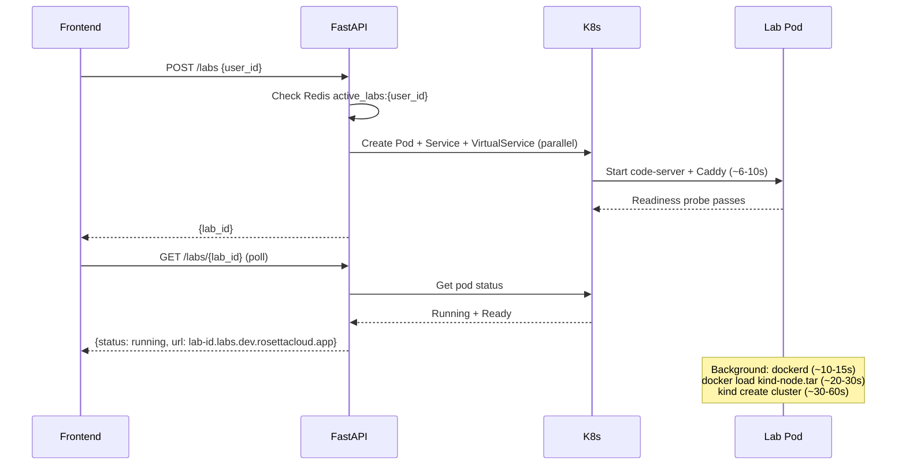

# RosettaCloud Backend

Production-ready FastAPI backend for the RosettaCloud learning platform, featuring event-driven architecture, AI-powered chatbot with multi-agent orchestration, and Kubernetes-based interactive lab management.

## 🏗️ Architecture Overview

The backend follows a clean **service/backend** separation pattern:
- **Services** (`app/services/`) — thin orchestration layer with business logic
- **Backends** (`app/backends/`) — concrete implementations (AWS SDK, Kubernetes API, Redis)
- **Agents** (`agents/`) — AI multi-agent system deployed via Amazon Bedrock AgentCore
- **Serverless** (`serverless/`) — Lambda functions for document indexing and agent tools

```
Backend/
├── app/                      # FastAPI application
│   ├── main.py              # API routes and entrypoint
│   ├── dependencies/
│   │   └── auth.py          # JWT decode + resolved_user_id (custom:user_id || sub + email fallback)
│   ├── services/            # Business logic layer
│   │   ├── labs_service.py
│   │   ├── users_service.py
│   │   └── questions_service.py
│   └── backends/            # Implementation layer
│       ├── labs_backends.py      # Kubernetes pod/service/VirtualService management
│       ├── users_backends.py     # DynamoDB + LMS integration
│       └── questions_backends.py # S3 + kubectl exec for question validation
├── agents/                  # AgentCore multi-agent platform
│   ├── agent.py            # Multi-agent router (tutor/grader/planner)
│   ├── prompts.py          # System prompts for each agent
│   ├── tools.py            # Tool definitions (not used in prod)
│   └── setup_gateway.py    # AgentCore Gateway configuration
├── serverless/             # AWS Lambda functions
│   └── Lambda/
│       ├── document_indexer/    # S3 → LanceDB vector indexing
│       └── agent_tools/         # AgentCore Gateway tool handler
├── questions/              # Shell script questions (synced to S3)
│   └── linux-docker-k8s-101/
│       └── intro-lesson-01/
│           ├── q1.sh
│           ├── q2.sh
│           └── ...
├── Dockerfile              # Multi-stage production build
└── requirements.txt        # Python dependencies
```

## 🚀 Quick Start

### Local Development

**Prerequisites:**
- Python 3.12+
- Redis server running locally
- kubectl configured with access to EKS cluster
- AWS credentials configured (`~/.aws/credentials`)

**Setup:**
```bash
cd Backend
pip install -r requirements.txt --break-system-packages

# Start Redis (Ubuntu/Debian)
sudo apt install redis-server
sudo service redis start

# Run development server
REDIS_HOST=localhost \
LAB_K8S_NAMESPACE=dev \
uvicorn app.main:app --reload --host 0.0.0.0 --port 8000
```

**Environment Variables (Local Dev):**
```bash
export AWS_REGION="us-east-1"
export REDIS_HOST="localhost"                    # K8s service name doesn't resolve locally
export LAB_K8S_NAMESPACE="dev"                   # Cluster uses 'dev', not default 'openedx'
export USERS_TABLE_NAME="rosettacloud-users"
export S3_BUCKET_NAME="rosettacloud-shared-interactive-labs"
export LANCEDB_S3_URI="s3://rosettacloud-shared-interactive-labs-vector"
export KNOWLEDGE_BASE_ID="shell-scripts-knowledge-base"
export COGNITO_ISSUER_URL="https://cognito-idp.us-east-1.amazonaws.com/us-east-1_jPds5WJ0I"
```

**Kill stale port:**
```bash
fuser -k 8000/tcp
```

### Production Deployment

**Docker Build:**
```bash
docker build -t rosettacloud-backend:latest .
docker tag rosettacloud-backend:latest 339712964409.dkr.ecr.us-east-1.amazonaws.com/rosettacloud-backend:latest
docker push 339712964409.dkr.ecr.us-east-1.amazonaws.com/rosettacloud-backend:latest
```

**Kubernetes Deployment:**
```bash
kubectl apply -f ../DevSecOps/K8S/backend-deployment.yaml
kubectl rollout restart deployment/rosettacloud-backend -n dev
kubectl get pods -n dev
```

**CI/CD:**
GitHub Actions workflow `.github/workflows/backend-build.yml` automatically builds and deploys on push to `Backend/app/**`, `Backend/Dockerfile`, or `Backend/requirements.txt`.

## 📊 Core Components

### 1. FastAPI Application (`app/main.py`)

**Main Features:**
- RESTful API with automatic OpenAPI documentation
- Async/await patterns for high concurrency
- CORS middleware for cross-origin requests
- Lifespan context manager for startup/shutdown
- In-process chat history cache (single-replica pod)

**API Endpoints:**

| Category | Method | Endpoint | Description |
|----------|--------|----------|-------------|
| **Users** | POST | `/users` | Create new user |
| | GET | `/users/{user_id}` | Get user by ID |
| | GET | `/users` | List users (paginated) |
| | PUT | `/users/{user_id}` | Update user |
| | DELETE | `/users/{user_id}` | Delete user |
| | GET | `/users/{user_id}/labs` | Get user's labs |
| | GET | `/users/{user_id}/progress` | Get learning progress |
| | POST | `/users/{user_id}/progress/{module}/{lesson}/{question}` | Update progress |
| **Labs** | POST | `/labs` | Launch new lab pod |
| | GET | `/labs/{lab_id}` | Get lab status |
| | DELETE | `/labs/{lab_id}` | Terminate lab |
| **Questions** | GET | `/questions/{module}/{lesson}` | Get all questions |
| | POST | `/questions/{module}/{lesson}/{question}/setup` | Execute question setup |
| | POST | `/questions/{module}/{lesson}/{question}/check` | Validate answer |
| **Chat** | POST | `/chat` | AI chatbot (multi-agent) |
| **System** | GET | `/health-check` | Health check |

**Chat Session Management:**
```python
# In-process session history (FastAPI backend pod)
_chat_histories: dict = {}  # session_id -> list of messages
_CHAT_HISTORY_TTL = 14400   # 4 hours
_CHAT_MAX_MESSAGES = 40     # 20 turns
_CHAT_MAX_SESSIONS = 500    # evict oldest when exceeded
```

Single-replica deployment makes this fully reliable for session continuity.


### 2. Labs Service & Backend (`labs_backends.py`)

**Kubernetes-based Interactive Lab Management**

Creates isolated lab environments using:
- **Pod** — privileged container running code-server + Docker-in-Docker + Kind
- **Service** — ClusterIP service targeting the pod
- **VirtualService** — Istio routing for `{lab_id}.labs.dev.rosettacloud.app`

**Lab Lifecycle:**



**Key Implementation Details:**

```python
# Configuration (environment variables)
NAMESPACE         = "dev"                    # Kubernetes namespace
POD_IMAGE         = "339712964409.dkr.ecr.us-east-1.amazonaws.com/interactive-labs:latest"
IMAGE_PULL_SECRET = "ecr-creds"
WILDCARD_DOMAIN   = "labs.dev.rosettacloud.app"
ISTIO_GATEWAY     = "rosettacloud-gateway"
POD_TTL_SECS      = 3600                     # 1 hour auto-cleanup
CONCURRENCY       = 5                        # Max parallel K8s operations

# Pod specification
- Privileged: True (required for Docker-in-Docker)
- No Istio sidecar: annotation "sidecar.istio.io/inject: false"
- Image pull policy: IfNotPresent (200ms cached pull)
- Readiness probe: HTTP GET / port 80, initial_delay=3s, period=3s, failure_threshold=40
```

**Resource Warning:**
Each lab runs a full Kind Kubernetes cluster. A t3.xlarge (4 CPU) supports platform services + **1 lab only**. Two concurrent Kind clusters starve the entire node.

**Auto-cleanup:**
Background janitor task runs every 60 seconds, terminates labs older than `POD_TTL_SECS`.

**Backend Restart Recovery:**
If the backend pod restarts, `get_lab_info()` probes Kubernetes to rediscover active labs and re-registers them in memory.

### 3. Users Service & Backend (`users_backends.py`)

**Dual Backend Support:**
- **DynamoDB** (default) — fully implemented, production-ready
- **LMS** — Open edX integration via REST API with metadata extension

**DynamoDB Schema:**
```python
{
  "user_id": "abc123",              # Partition key
  "email": "user@example.com",      # GSI: email-index
  "name": "John Doe",
  "password": "hashed",
  "role": "user",
  "created_at": 1234567890,
  "updated_at": 1234567890,
  "labs": ["lab-abc", "lab-def"],   # List of lab IDs
  "active_lab": "lab-abc",          # Current active lab (one per user)
  "progress": {                     # Nested progress tracking
    "module-uuid": {
      "lesson-uuid": {
        "1": true,                  # Question 1 completed
        "2": false,
        "3": true
      }
    }
  },
  "metadata": {}
}
```

**LMS Backend:**
Uses Open edX REST API with extension data stored in user `metadata` field under `rosettacloud` namespace. Supports OAuth2 client credentials flow with automatic token refresh.

**Backend Selection:**
```bash
export USERS_BACKEND=dynamodb   # default
export USERS_BACKEND=lms        # Open edX integration
```

### 4. Questions Service & Backend (`questions_backends.py`)

**Shell Script-Based Question System**

Questions are stored as shell scripts in S3 with metadata in header comments:

```bash
#!/bin/bash

# Question Number: 1
# Question: Create a directory at /home/ubuntu named my_new_directory.
# Question Type: Check
# Question Difficulty: Medium

# -q flag: Setup script (runs before student attempts)
if [[ "$1" == "-q" ]]; then
    echo "No setup required for this Check."
    exit 0
fi

# -c flag: Validation script (checks student's answer)
if [[ "$1" == "-c" ]]; then
  if [ -d "/home/ubuntu/my_new_directory" ]; then
    echo "Directory exists: /home/ubuntu/my_new_directory"
    exit 0
  else
    echo "Directory does not exist."
    exit 1
  fi
fi
```

**Question Types:**
- **MCQ (Multiple Choice)** — Frontend validates client-side, updates DynamoDB
- **Check (Practical)** — Backend executes validation script in pod via `kubectl exec`

**Execution Flow:**

1. **Setup** (`POST /questions/{module}/{lesson}/{question}/setup`):
   - Extract `-q` block from shell script
   - `kubectl cp` script to pod at `/tmp/{question_number}_q_script.sh`
   - `kubectl exec` to run script
   - Return success/failure

2. **Check** (`POST /questions/{module}/{lesson}/{question}/check`):
   - Extract `-c` block from shell script
   - `kubectl cp` script to pod
   - `kubectl exec` to run validation
   - Exit code 0 = correct → update DynamoDB progress
   - Exit code 1 = incorrect

**Concurrency Safety:**
Per-pod `asyncio.Lock` prevents concurrent `kubectl cp` operations from corrupting the tar stream ("unexpected EOF" error).

**Caching:**
In-memory TTL cache (1 hour) for parsed questions and shell script content. No external cache dependency.

**Timeout:**
All kubectl operations have 30-second timeout to prevent hanging requests.


## 🤖 AI Multi-Agent System

### AgentCore Runtime (`agents/`)

**Architecture:**
Amazon Bedrock AgentCore hosts a multi-agent platform with three specialized agents:
- **Tutor** — DevOps concept teaching (hints-first pedagogy)
- **Grader** — Assessment and feedback generation
- **Planner** — Learning path recommendations

**Deployment:**
```bash
cd agents
agentcore configure -e agent.py -n rosettacloud_education_agent \
  -er arn:aws:iam::ACCOUNT_ID:role/rosettacloud-agentcore-runtime-role \
  -rf requirements.txt -r us-east-1 -ni

agentcore launch --auto-update-on-conflict \
  --env BEDROCK_AGENTCORE_MEMORY_ID=rosettacloud_education_memory-evO1o3F0jN \
  --env GATEWAY_URL=$GATEWAY_URL

agentcore status
```

**Current Deployment:**
- Runtime ARN: `arn:aws:bedrock-agentcore:us-east-1:339712964409:runtime/rosettacloud_education_agent-yebWcC9Yqy`
- Memory ID: `rosettacloud_education_memory-evO1o3F0jN`
- Model: `amazon.nova-lite-v1:0` (all agents)
- Region: `us-east-1`

**Agent Routing (`agent.py`):**

```python
def _classify(message: str, msg_type: str) -> str:
    if msg_type == "grade":   return "grader"
    if msg_type == "hint":    return "tutor"
    if msg_type == "session_start": return "planner"
    if msg_type == "explain": return "tutor"
    
    # Keyword-based classification
    lower = message.lower()
    if any(k in lower for k in ["what should i learn", "what next", "learning path"]):
        return "planner"
    if any(k in lower for k in ["how am i doing", "my progress", "my grade"]):
        return "grader"
    
    # Fallback: Nova Lite classifier
    result = bedrock.converse(
        modelId="amazon.nova-lite-v1:0",
        messages=[{"role": "user", "content": [{"text": message}]}],
        system=[{"text": CLASSIFIER_PROMPT}],
        inferenceConfig={"maxTokens": 10, "temperature": 0},
    )
    return result["output"]["message"]["content"][0]["text"].strip().lower()
```

**Tool Access Control:**
```python
_AGENT_TOOL_NAMES = {
    "tutor":   {"search_knowledge_base", "get_question_details", "get_question_metadata"},
    "grader":  {"get_question_details", "get_user_progress", "get_attempt_result"},
    "planner": {"get_user_progress", "list_available_modules", "get_question_metadata"},
}
```

**Session Management:**

1. **In-process history (FastAPI):**
   - `_chat_histories` dict keyed by `session_id`
   - Max 40 messages (20 turns), 4-hour TTL, max 500 sessions
   - Sent to AgentCore as `conversation_history` in payload

2. **In-process history (AgentCore):**
   - `_session_histories` dict in AgentCore Runtime container
   - Fallback for CLI invocations (`agentcore invoke`)

3. **AgentCore Memory:**
   - Long-term cross-session persistence via `AgentCoreMemorySessionManager`
   - Keyed by `actor_id` (user_id) and `session_id`
   - Survives backend restarts

**Multimodal Support (Snap & Ask):**
```python
if image_b64:
    import base64
    raw = image_b64.split(",")[-1] if "," in image_b64 else image_b64
    image_bytes = base64.b64decode(raw)
    user_msg = [{"role": "user", "content": [
        {"text": f"Student ({context_str}): {message}"},
        {"image": {"format": "jpeg", "source": {"bytes": image_bytes}}},
    ]}]
    result = agent(user_msg)
```

Frontend captures screen via `getDisplayMedia()`, converts to JPEG base64 (max 1280px, quality 0.75), sends to `/chat` endpoint. Backend validates JPEG magic bytes (`ff d8 ff`) before forwarding to Nova Lite vision model.

### AgentCore Gateway & Tools

**Gateway Setup (`setup_gateway.py`):**
```python
# One-time setup
gateway = agentcore_client.create_gateway(
    gatewayName="rosettacloud-education-tools",
    authConfig={"type": "NONE"},  # Network-level security
)

# Register Lambda target
agentcore_client.create_gateway_target(
    gatewayName="rosettacloud-education-tools",
    targetName="education-tools",
    targetConfig={
        "type": "LAMBDA",
        "lambdaArn": "arn:aws:lambda:us-east-1:ACCOUNT_ID:function:agent_tools",
    },
)
```

**Tool Naming Convention:**
- **MCP protocol name:** `education-tools___search-knowledge-base` (with prefix and hyphens)
- **Agent-facing name:** `search_knowledge_base` (normalized for Nova Lite compatibility)
- **Lambda dispatch name:** `search_knowledge_base` (normalized from context)

**Lambda Handler (`serverless/Lambda/agent_tools/handler.py`):**

```python
def lambda_handler(event, context):
    # Tool name is in context.client_context.custom (NOT in event)
    full_tool_name = context.client_context.custom.get("bedrockAgentCoreToolName", "")
    
    # Strip prefix: "education-tools___get-question-details" → "get-question-details"
    raw_name = full_tool_name.split("___", 1)[-1] if "___" in full_tool_name else full_tool_name
    
    # Normalize hyphens: "get-question-details" → "get_question_details"
    tool_name = raw_name.replace("-", "_")
    
    # Event IS the flat tool input parameters
    tool_input = {k.replace("-", "_"): v for k, v in event.items()}
    
    # Dispatch to tool function
    return _TOOLS[tool_name](tool_input)
```

**Available Tools:**

| Tool | Agent | Description |
|------|-------|-------------|
| `search_knowledge_base` | Tutor | LanceDB vector search for DevOps concepts |
| `get_question_details` | Tutor, Grader | Fetch question text, type, difficulty, correct answer |
| `get_question_metadata` | Tutor, Planner | List all questions in a lesson |
| `get_user_progress` | Grader, Planner | Fetch student's completion status |
| `get_attempt_result` | Grader | Check if specific question is completed |
| `list_available_modules` | Planner | List all modules and lessons |

### Document Indexing (`serverless/Lambda/document_indexer/`)

**Pipeline:**
1. Shell scripts uploaded to `s3://rosettacloud-shared-interactive-labs/{module}/{lesson}/`
2. S3 EventBridge notification triggers `document_indexer` Lambda
3. Lambda processes scripts:
   - Extracts metadata from header comments
   - Parses `-q` and `-c` flag handlers
   - Splits content into chunks (1000 chars, 200 overlap)
   - Generates embeddings via Amazon Titan Embed v2
4. Stores vectors in LanceDB at `s3://rosettacloud-shared-interactive-labs-vector`

**Metadata Extraction:**
```python
def _parse_shell_headers(content: str) -> dict:
    meta = {}
    # Question Number: 1
    m = re.search(r"#\s*Question\s+Number:\s*(\d+)", content, re.I)
    if m: meta["question_number"] = int(m.group(1))
    
    # Question: What command...
    m = re.search(r"#\s*Question:\s*(.*?)($|\n)", content)
    if m: meta["question_text"] = m.group(1).strip()
    
    # Question Type: MCQ|Check
    m = re.search(r"#\s*Question\s+Type:\s*(MCQ|Check)", content, re.I)
    if m: meta["question_type"] = m.group(1)
    
    # Question Difficulty: Easy|Medium|Hard
    m = re.search(r"#\s*Question\s+Difficulty:\s*(Easy|Medium|Hard)", content, re.I)
    if m: meta["difficulty"] = m.group(1).capitalize()
    
    # Parse MCQ choices and correct answer
    # ...
    
    return meta
```

**LanceDB Schema:**
```python
{
    "vector": [0.123, 0.456, ...],           # 1024-dim Titan embedding
    "document": "enhanced shell script text",
    "file_name": "q1.sh",
    "full_path": "linux-docker-k8s-101/intro-lesson-01/q1.sh",
    "indexed_at": 1234567890.0,
    "file_type": "shell_script",
    "question_number": 1,
    "question_text": "Create a directory...",
    "question_type": "Check",
    "difficulty": "Medium",
}
```


## 🔄 API Request/Response Examples

### POST /chat — AI Chatbot

**Request:**
```json
{
  "message": "What is Docker?",
  "user_id": "user-123",
  "session_id": "session-abc123-1234567890",
  "module_uuid": "linux-docker-k8s-101",
  "lesson_uuid": "intro-lesson-01",
  "type": "chat"
}
```

**Response:**
```json
{
  "response": "Docker is a platform for containerizing applications...",
  "agent": "tutor",
  "session_id": "session-abc123-1234567890"
}
```

**Message Types:**
- `chat` — General conversation (default)
- `hint` — Request hint for a question
- `grade` — Auto-grade message (includes `question_number`, `result`)
- `session_start` — Welcome message when lab starts
- `explain` — One-sentence explanation of a command

**Session ID Requirements:**
- Must be 33+ characters (AgentCore requirement)
- Frontend generates: `"session-<uuid>-<timestamp>"`
- Stable for entire chat session (page load)

**Multimodal (Snap & Ask):**
```json
{
  "message": "What's wrong with this terminal output?",
  "user_id": "user-123",
  "session_id": "session-abc123-1234567890",
  "type": "chat",
  "image": "data:image/jpeg;base64,/9j/4AAQSkZJRg..."
}
```

### POST /labs — Launch Lab

**Request:**
```json
{
  "user_id": "user-123"
}
```

**Response:**
```json
{
  "lab_id": "lab-abc12345"
}
```

**Error (Active Lab Exists):**
```json
{
  "detail": "You already have an active lab. Please terminate the existing lab first."
}
```

### GET /labs/{lab_id} — Lab Status

**Response (Starting):**
```json
{
  "lab_id": "lab-abc12345",
  "hostname": "lab-abc12345.labs.dev.rosettacloud.app",
  "url": "https://lab-abc12345.labs.dev.rosettacloud.app",
  "pod_ip": "10.0.1.42",
  "status": "starting",
  "pod_name": "lab-lab-abc12345",
  "time_remaining": {
    "minutes": 59,
    "seconds": 45,
    "total_seconds": 3585
  }
}
```

**Response (Running):**
```json
{
  "lab_id": "lab-abc12345",
  "hostname": "lab-abc12345.labs.dev.rosettacloud.app",
  "url": "https://lab-abc12345.labs.dev.rosettacloud.app",
  "pod_ip": "10.0.1.42",
  "status": "running",
  "pod_name": "lab-lab-abc12345",
  "time_remaining": {
    "minutes": 58,
    "seconds": 30,
    "total_seconds": 3510
  }
}
```

**Response (Not Found):**
```json
{
  "error": "lab not found"
}
```

### GET /questions/{module}/{lesson} — Get Questions

**Response:**
```json
{
  "questions": [
    {
      "question_number": 1,
      "question": "Create a directory at /home/ubuntu named my_new_directory.",
      "question_type": "Check",
      "question_difficulty": "Medium"
    },
    {
      "question_number": 2,
      "question": "Which command lists files in a directory?",
      "question_type": "MCQ",
      "question_difficulty": "Easy",
      "answer_choices": ["ls", "cd", "pwd", "mkdir"],
      "correct_answer": "ls"
    }
  ],
  "total_count": 2
}
```

### POST /questions/{module}/{lesson}/{question}/check — Validate Answer

**Request:**
```json
{
  "pod_name": "lab-lab-abc12345"
}
```

**Response (Success):**
```json
{
  "status": "success",
  "message": "Question 1 completed successfully",
  "completed": true
}
```

**Response (Failure):**
```json
{
  "status": "error",
  "message": "Failed validation for question 1",
  "completed": false
}
```

## 🔧 Configuration

### Environment Variables

| Variable | Default | Description |
|----------|---------|-------------|
| `AWS_REGION` | `us-east-1` | AWS region for all services |
| `REDIS_HOST` | `redis-service` | Redis hostname (use `localhost` for local dev) |
| `REDIS_PORT` | `6379` | Redis port |
| `LAB_K8S_NAMESPACE` | `openedx` | Kubernetes namespace for lab pods (use `dev` for cluster) |
| `LAB_POD_IMAGE` | `339712964409.dkr.ecr.us-east-1.amazonaws.com/interactive-labs:latest` | Lab container image |
| `LAB_IMAGE_PULL_SECRET` | `ecr-creds` | Kubernetes image pull secret |
| `LAB_WILDCARD_DOMAIN` | `labs.dev.rosettacloud.app` | Wildcard domain for lab URLs |
| `LAB_ISTIO_GATEWAY` | `rosettacloud-gateway` | Istio gateway name |
| `LAB_POD_TTL_SECS` | `3600` | Lab auto-cleanup timeout (1 hour) |
| `LAB_CONCURRENT_TASKS_LIMIT` | `5` | Max parallel Kubernetes operations |
| `USERS_TABLE_NAME` | `rosettacloud-users` | DynamoDB table name |
| `S3_BUCKET_NAME` | `rosettacloud-shared-interactive-labs` | S3 bucket for questions |
| `LANCEDB_S3_URI` | `s3://rosettacloud-shared-interactive-labs-vector` | LanceDB vector store location |
| `KNOWLEDGE_BASE_ID` | `shell-scripts-knowledge-base` | LanceDB table name |
| `AGENT_RUNTIME_ARN` | — | AgentCore Runtime ARN (set in K8s ConfigMap) |
| `BEDROCK_AGENTCORE_MEMORY_ID` | — | AgentCore Memory ID for cross-session persistence |
| `USERS_BACKEND` | `dynamodb` | User backend: `dynamodb` or `lms` |
| `LAB_BACKEND` | `eks` | Lab backend (only `eks` implemented) |

### AWS Credentials

**In-cluster (Production):**
- IRSA (IAM Roles for Service Accounts) provides credentials automatically
- No static credentials needed

**Local Development:**
- Uses `~/.aws/credentials` via AWS CLI profile
- Configure with `aws configure`

### Backend Selection

**Users Backend:**
```bash
export USERS_BACKEND=dynamodb   # default, production-ready
export USERS_BACKEND=lms        # Open edX integration
```

**Labs Backend:**
```bash
export LAB_BACKEND=eks   # default (only implementation)
```

## 🧪 Testing

**Manual API Testing:**
```bash
# Health check
curl http://localhost:8000/health-check

# Create user
curl -X POST http://localhost:8000/users \
  -H "Content-Type: application/json" \
  -d '{"email":"test@example.com","name":"Test User","password":"test123"}'

# Launch lab
curl -X POST http://localhost:8000/labs \
  -H "Content-Type: application/json" \
  -d '{"user_id":"abc123"}'

# Get lab status
curl http://localhost:8000/labs/lab-abc12345?user_id=abc123

# Chat with AI
curl -X POST http://localhost:8000/chat \
  -H "Content-Type: application/json" \
  -d '{
    "message": "What is Docker?",
    "user_id": "abc123",
    "session_id": "session-test-1234567890abcdef1234",
    "type": "chat"
  }'
```

**AgentCore Direct Invocation:**
```bash
cd agents
agentcore invoke '{
  "message": "What is Docker?",
  "user_id": "test",
  "session_id": "test-session-1234567890abcdef1234"
}'
```

**AgentCore Logs:**
```bash
aws logs tail /aws/bedrock-agentcore/runtimes/rosettacloud_education_agent-yebWcC9Yqy --follow
```

**Lambda Logs:**
```bash
aws logs tail /aws/lambda/document_indexer --follow --region us-east-1
aws logs tail /aws/lambda/agent_tools --follow --region us-east-1
```

**Note:** Automated test suite not yet implemented. Manual testing via API calls and `agentcore invoke` is the current approach.


## 🚀 CI/CD Workflows

### GitHub Actions Pipelines

| Workflow | Trigger | Action |
|----------|---------|--------|
| **Backend Build** | Push to `Backend/app/**`, `Backend/Dockerfile`, `Backend/requirements.txt` | Build Docker image → ECR push → EKS rolling restart |
| **Agent Deploy** | Push to `Backend/agents/**` | `agentcore launch` via CodeBuild (ARM64) → update K8s ConfigMap with new ARN |
| **Lambda Deploy** | Push to `Backend/serverless/Lambda/**` | Build & push `document_indexer` and `agent_tools` containers → update Lambda |
| **Questions Sync** | Push to `Backend/questions/**` | Sync shell scripts to S3 → triggers EventBridge → document indexing |

**Authentication:**
All workflows use **GitHub OIDC** — no static AWS credentials stored in secrets.

**IAM Role:**
`github-actions-role` with permissions for ECR, EKS, Lambda, S3, AgentCore, and CodeBuild.

### Manual Deployment

**Backend:**
```bash
# Build and push
docker build -t rosettacloud-backend:latest .
aws ecr get-login-password --region us-east-1 | docker login --username AWS --password-stdin 339712964409.dkr.ecr.us-east-1.amazonaws.com
docker tag rosettacloud-backend:latest 339712964409.dkr.ecr.us-east-1.amazonaws.com/rosettacloud-backend:latest
docker push 339712964409.dkr.ecr.us-east-1.amazonaws.com/rosettacloud-backend:latest

# Deploy to Kubernetes
kubectl rollout restart deployment/rosettacloud-backend -n dev
kubectl get pods -n dev -w
```

**AgentCore:**
```bash
cd agents
agentcore launch --auto-update-on-conflict \
  --env BEDROCK_AGENTCORE_MEMORY_ID=rosettacloud_education_memory-evO1o3F0jN \
  --env GATEWAY_URL=$GATEWAY_URL

# Update K8s ConfigMap with new ARN
NEW_ARN=$(agentcore status | grep "Runtime ARN" | awk '{print $3}')
kubectl set env deployment/rosettacloud-backend AGENT_RUNTIME_ARN=$NEW_ARN -n dev
```

**Lambda:**
```bash
cd serverless/Lambda/document_indexer
docker build -t document_indexer:latest .
aws ecr get-login-password --region us-east-1 | docker login --username AWS --password-stdin 339712964409.dkr.ecr.us-east-1.amazonaws.com
docker tag document_indexer:latest 339712964409.dkr.ecr.us-east-1.amazonaws.com/document_indexer:latest
docker push 339712964409.dkr.ecr.us-east-1.amazonaws.com/document_indexer:latest
aws lambda update-function-code --function-name document_indexer --image-uri 339712964409.dkr.ecr.us-east-1.amazonaws.com/document_indexer:latest
```

**Questions:**
```bash
aws s3 sync questions/ s3://rosettacloud-shared-interactive-labs/ --delete
```

## 📊 Monitoring & Observability

### Logging

**Application Logs:**
```bash
# Backend pod logs
kubectl logs -f deployment/rosettacloud-backend -n dev

# Specific pod
kubectl logs -f pod/rosettacloud-backend-abc123-xyz -n dev

# Previous pod (after crash)
kubectl logs --previous pod/rosettacloud-backend-abc123-xyz -n dev
```

**AgentCore Logs:**
```bash
aws logs tail /aws/bedrock-agentcore/runtimes/rosettacloud_education_agent-yebWcC9Yqy --follow
```

**Lambda Logs:**
```bash
aws logs tail /aws/lambda/document_indexer --follow
aws logs tail /aws/lambda/agent_tools --follow
```

### Metrics

**Key Performance Indicators:**
- Lab provisioning time: ~6-10s (pod ready), ~60-90s (Kind cluster)
- AI response time: ~1-2s typical
- Chat history cache hit rate: ~95%
- Question validation time: ~2-5s (kubectl exec overhead)

**Kubernetes Metrics:**
```bash
# Pod resource usage
kubectl top pods -n dev

# Node resource usage
kubectl top nodes

# HPA status
kubectl get hpa -n dev
```

### Health Checks

**Endpoint:**
```bash
curl http://localhost:8000/health-check
```

**Response:**
```json
{
  "status": "healthy",
  "timestamp": 1234567890.123
}
```

**Kubernetes Probes:**
- Readiness: HTTP GET `/health-check` (not yet implemented in deployment)
- Liveness: HTTP GET `/health-check` (not yet implemented in deployment)

## 🐛 Troubleshooting

### Common Issues

**1. Lab Pod Stuck in "Starting" Status**

**Symptoms:**
- `GET /labs/{lab_id}` returns `"status": "starting"` for > 2 minutes
- Pod exists but readiness probe fails

**Diagnosis:**
```bash
kubectl describe pod lab-{lab_id} -n dev
kubectl logs lab-{lab_id} -n dev
```

**Common Causes:**
- Caddy not starting (port 80 conflict)
- Image pull failure (ECR credentials expired)
- Resource limits exceeded (CPU/memory)

**Solution:**
```bash
# Check pod events
kubectl get events -n dev --sort-by='.lastTimestamp' | grep lab-{lab_id}

# Restart pod
kubectl delete pod lab-{lab_id} -n dev

# Check node resources
kubectl top nodes
```

**2. kubectl exec Timeout in Questions Backend**

**Symptoms:**
- `POST /questions/{module}/{lesson}/{question}/check` returns 500 error
- Logs show "kubectl exec timed out after 30s"

**Diagnosis:**
```bash
# Check pod status
kubectl get pod lab-{lab_id} -n dev

# Try manual kubectl exec
kubectl exec lab-{lab_id} -n dev -- bash -c "echo test"
```

**Common Causes:**
- Pod not running
- Network latency to API server
- Pod under heavy load (Kind cluster consuming all CPU)

**Solution:**
```bash
# Increase timeout in questions_backends.py
_KUBECTL_TIMEOUT = 60  # was 30

# Check pod resource usage
kubectl top pod lab-{lab_id} -n dev
```

**3. Chat History Lost After Backend Restart**

**Symptoms:**
- User loses conversation context after backend pod restart
- `session_id` still valid but history empty

**Explanation:**
In-process `_chat_histories` dict is cleared on pod restart. This is expected behavior.

**Mitigation:**
- AgentCore Memory provides long-term persistence (survives restarts)
- Frontend can implement local storage backup
- Consider Redis-backed session storage for production

**4. AgentCore Tool Call Failures**

**Symptoms:**
- Chat responses contain "Tool error: Unknown tool"
- Logs show "Unknown tool: get-question-details"

**Diagnosis:**
```bash
# Check AgentCore logs
aws logs tail /aws/bedrock-agentcore/runtimes/rosettacloud_education_agent-yebWcC9Yqy --follow

# Check Lambda logs
aws logs tail /aws/lambda/agent_tools --follow
```

**Common Causes:**
- Tool name normalization mismatch (hyphens vs underscores)
- Gateway URL not set in AgentCore environment
- Lambda function not deployed

**Solution:**
```bash
# Verify Gateway URL
agentcore status | grep GATEWAY_URL

# Test Lambda directly
aws lambda invoke --function-name agent_tools \
  --payload '{"query":"test"}' \
  response.json

# Redeploy agent with correct Gateway URL
agentcore launch --auto-update-on-conflict --env GATEWAY_URL=$GATEWAY_URL
```

**5. Document Indexer Not Triggering**

**Symptoms:**
- New shell scripts uploaded to S3 but not appearing in LanceDB
- `search_knowledge_base` returns old results

**Diagnosis:**
```bash
# Check EventBridge rule
aws events list-rules --name-prefix rosettacloud

# Check Lambda logs
aws logs tail /aws/lambda/document_indexer --follow

# Manually trigger Lambda
aws lambda invoke --function-name document_indexer \
  --payload '{
    "detail-type": "Object Created",
    "source": "aws.s3",
    "detail": {
      "bucket": {"name": "rosettacloud-shared-interactive-labs"},
      "object": {"key": "linux-docker-k8s-101/intro-lesson-01/q1.sh"}
    }
  }' \
  response.json
```

**Common Causes:**
- EventBridge rule disabled
- Lambda execution role missing S3 permissions
- LanceDB S3 bucket permissions issue

**Solution:**
```bash
# Enable EventBridge rule
aws events enable-rule --name rosettacloud-s3-object-created

# Check Lambda IAM role
aws iam get-role --role-name document_indexer-role

# Verify S3 bucket policy
aws s3api get-bucket-policy --bucket rosettacloud-shared-interactive-labs-vector
```

## 🔐 Security Considerations

### Authentication & JWT

All API routes (except `GET /health-check`, `POST /users`, `OPTIONS /{proxy+}`) are protected by **API Gateway HTTP API JWT authorizer** backed by Amazon Cognito.

**Auth flow:**
1. Frontend calls Cognito SDK directly (`SignUpCommand` / `InitiateAuthCommand`)
2. On login, Cognito issues an **ID token** containing `custom:user_id` (or `sub` for brand-new users)
3. `AuthInterceptor` attaches `Authorization: Bearer <id_token>` to every API request
4. API Gateway validates signature/expiry before forwarding to FastAPI
5. `app/dependencies/auth.py` decodes claims and sets `resolved_user_id = custom:user_id || sub`
6. `_require_user()` falls back to email lookup if `resolved_user_id` is a Cognito sub (first login before token refresh)

**`POST /users` (registration):**
- No JWT required (user has no token yet)
- After creating the DynamoDB record, calls `admin_update_user_attributes` to set `custom:user_id` in Cognito so the *next* login's ID token resolves correctly
- Requires `cognito-idp:AdminUpdateUserAttributes` permission on the IRSA role

### IAM Roles & Permissions

**Backend Pod (IRSA):**
- DynamoDB: GetItem, PutItem, UpdateItem, DeleteItem, Query, Scan
- S3: GetObject, ListBucket (questions bucket)
- Bedrock: InvokeModel, InvokeAgentRuntime
- Kubernetes: Pod/Service/VirtualService create/read/delete (via kubeconfig)

**AgentCore Runtime:**
- Bedrock: InvokeModel (Nova Lite, Titan Embed)
- DynamoDB: GetItem (users table)
- S3: GetObject, ListBucket (questions + vector buckets)
- ECR: GetAuthorizationToken, BatchGetImage, GetDownloadUrlForLayer
- CloudWatch Logs: CreateLogGroup, CreateLogStream, PutLogEvents
- X-Ray: PutTraceSegments, PutTelemetryRecords
- AgentCore Memory: Read/Write

**Lambda Functions:**
- S3: GetObject, ListBucket
- Bedrock: InvokeModel (Titan Embed)
- DynamoDB: GetItem
- CloudWatch Logs: CreateLogGroup, CreateLogStream, PutLogEvents

### Network Security

**Istio Service Mesh:**
- mTLS between services (except lab pods)
- Lab pods opt out: `sidecar.istio.io/inject: "false"`
- VirtualService routing for external access

**Kubernetes Network Policies:**
Not yet implemented. Consider adding:
- Deny all ingress by default
- Allow ingress from Istio gateway only
- Allow egress to AWS services only

### Secrets Management

**Current Approach:**
- AWS credentials via IRSA (no static keys)
- Kubernetes secrets for ECR credentials
- Environment variables for non-sensitive config

**Recommendations:**
- Use AWS Secrets Manager for sensitive config
- Rotate ECR credentials regularly
- Implement secret scanning in CI/CD

## 📚 Additional Resources

### Documentation
- [FastAPI Documentation](https://fastapi.tiangolo.com/)
- [Kubernetes Python Client](https://github.com/kubernetes-client/python)
- [Amazon Bedrock AgentCore](https://docs.aws.amazon.com/bedrock/latest/userguide/agents.html)
- [Strands Agents SDK](https://github.com/awslabs/strands)
- [LanceDB Documentation](https://lancedb.github.io/lancedb/)

### Related Files
- `../DevSecOps/K8S/` — Kubernetes manifests
- `../Frontend/` — Angular frontend
- `../CLAUDE.md` — Technical implementation guide
- `../README.md` — Project overview

## 👨‍💻 Development Guidelines

### Code Style
- Follow PEP 8 for Python code
- Use type hints for function signatures
- Document complex logic with inline comments
- Keep functions focused and single-purpose

### Adding New Endpoints
1. Define Pydantic models for request/response
2. Add route in `app/main.py`
3. Implement business logic in service layer
4. Add backend implementation if needed
5. Update this README with API documentation

### Adding New Agent Tools
1. Define tool function in `agents/tools.py` (for reference)
2. Implement tool in `serverless/Lambda/agent_tools/handler.py`
3. Add tool to dispatch table `_TOOLS`
4. Update `_AGENT_TOOL_NAMES` in `agents/agent.py`
5. Update agent prompts in `agents/prompts.py`
6. Deploy Lambda and redeploy AgentCore

### Testing Checklist
- [ ] Manual API testing with curl
- [ ] AgentCore direct invocation
- [ ] Lab pod creation and termination
- [ ] Question setup and validation
- [ ] Chat with all three agents
- [ ] Multimodal image analysis
- [ ] Session persistence across requests

---

**Last Updated:** 2026-03-08  
**Maintainer:** Mohamed Sorour (mohamedsorour1998@gmail.com)  
**License:** MIT

