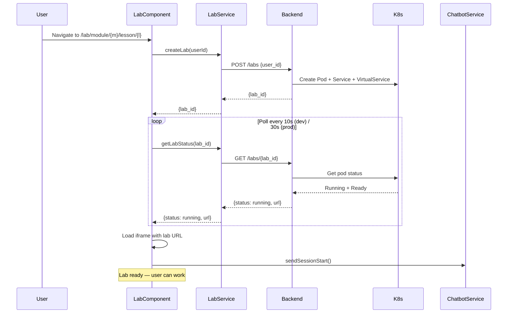

# RosettaCloud Frontend

Modern Angular 19 single-page application (SPA) for the RosettaCloud learning platform, featuring interactive lab environments, AI-powered chatbot with multimodal support, and real-time progress tracking.

## 🏗️ Architecture Overview

**Technology Stack:**
- **Angular 19** — Latest version with standalone components
- **TypeScript 5.7** — Strict mode enabled
- **Custom SCSS design system** — Dark blueprint aesthetic (Syne + Figtree + JetBrains Mono)
- **xterm.js** — Browser-based terminal emulation
- **RxJS 7.8** — Reactive programming with observables
- **nginx** — Production web server

**Build System:**
- Multi-stage Docker build (Node.js → nginx)
- Angular CLI with production optimizations
- Environment-specific configurations
- Lazy loading and code splitting

```
Frontend/
├── src/
│   ├── app/
│   │   ├── lab/                    # Interactive lab component (main feature)
│   │   ├── chatbot/                # AI chatbot UI
│   │   ├── dashboard/              # User dashboard
│   │   ├── services/               # Core services
│   │   │   ├── chatbot.service.ts  # AI chat HTTP client
│   │   │   ├── lab.service.ts      # Lab management
│   │   │   ├── user.service.ts     # User management
│   │   │   └── feedback.service.ts # Feedback generation
│   │   ├── guards/                 # Route guards (auth, admin)
│   │   ├── interceptors/           # HTTP interceptors
│   │   └── [30+ components]        # UI components
│   ├── environments/               # Environment configs
│   ├── styles.scss                 # Global styles
│   └── index.html                  # SPA entry point
├── angular.json                    # Angular CLI configuration
├── package.json                    # Dependencies
├── Dockerfile                      # Multi-stage production build
├── nginx.conf                      # nginx SPA routing config
└── tsconfig.json                   # TypeScript configuration
```

## 🚀 Quick Start

### Local Development

**Prerequisites:**
- Node.js 18.19.1+ and npm
- Angular CLI 19.2.6+

**Setup:**
```bash
cd Frontend
npm install

# Development server (port 4200)
ng serve

# Development with specific environment
ng serve -c=development  # default
ng serve -c=uat
ng serve -c=stg
```

**Access:**
- Local: http://localhost:4200
- Auto-reload on file changes

### Production Build

**Build:**
```bash
# Production build (optimized)
ng build --configuration=production

# Output: dist/rosetta-cloud-frontend/browser/
```

**Docker Build:**
```bash
# Multi-stage build (Node.js → nginx)
docker build -t rosettacloud-frontend:latest .

# Run locally
docker run -p 8080:80 rosettacloud-frontend:latest
```

**CI/CD:**
GitHub Actions workflow `.github/workflows/frontend-build.yml` automatically builds and deploys on push to `Frontend/src/**`, `Frontend/Dockerfile`, `Frontend/package.json`, `Frontend/angular.json`, or `Frontend/nginx.conf`.

### Testing

```bash
# Unit tests (Karma + Jasmine)
ng test

# Linting
ng lint

# Security audit
npm audit
```

## 📊 Core Features

### 1. Interactive Lab Environment (`lab/`)

**Main Component:** `LabComponent` — Full-screen lab interface with split-pane layout

**Features:**
- **Browser-based Terminal** — xterm.js with WebSocket-like iframe communication
- **Question Panel** — MCQ and practical check questions
- **AI Chatbot** — Integrated chat panel with multimodal support
- **Progress Tracking** — Real-time completion status
- **Lab Timer** — Countdown with auto-cleanup warning

**Lab Lifecycle:**



**Key Implementation Details:**

```typescript
// lab.component.ts
export class LabComponent implements OnInit, OnDestroy {
  labId: string | null = null;
  labUrl: string | null = null;
  labStatus: 'pending' | 'starting' | 'running' | 'error' = 'pending';
  
  questions: Question[] = [];
  userProgress: { [key: string]: boolean } = {};
  
  private pollingSubscription?: Subscription;
  private readonly POLLING_INTERVAL = environment.pollingInterval; // 10s dev, 30s prod
  
  ngOnInit(): void {
    // Extract module/lesson from route params
    this.route.params.subscribe(params => {
      this.moduleUuid = params['moduleUuid'];
      this.lessonUuid = params['lessonUuid'];
      
      // Create lab
      this.createLab();
      
      // Load questions
      this.loadQuestions();
      
      // Load user progress
      this.loadUserProgress();
    });
  }
  
  private createLab(): void {
    this.labService.createLab(this.userId).subscribe({
      next: (response) => {
        this.labId = response.lab_id;
        this.startPolling();
      },
      error: (err) => {
        // Handle "active lab exists" error
        if (err.status === 400) {
          this.showError('You already have an active lab. Please terminate it first.');
        }
      }
    });
  }
  
  private startPolling(): void {
    this.pollingSubscription = interval(this.POLLING_INTERVAL)
      .pipe(
        switchMap(() => this.labService.getLabStatus(this.labId!, this.userId))
      )
      .subscribe({
        next: (status) => {
          this.labStatus = status.status;
          if (status.status === 'running') {
            this.labUrl = status.url;
            this.stopPolling();
            // Send welcome message via chatbot
            this.chatbotService.sendSessionStart(this.moduleUuid, this.lessonUuid);
          }
        }
      });
  }
  
  private stopPolling(): void {
    this.pollingSubscription?.unsubscribe();
  }
  
  ngOnDestroy(): void {
    this.stopPolling();
  }
}
```

**Question Types:**

1. **MCQ (Multiple Choice):**
   - Frontend validates answer client-side
   - Correct answer from cached question data
   - Updates DynamoDB progress on correct answer
   - Triggers auto-grade message to chatbot

2. **Practical Check:**
   - "Setup" button → `POST /questions/{module}/{lesson}/{question}/setup`
   - User works in terminal
   - "Check Solution" → `POST /questions/{module}/{lesson}/{question}/check`
   - Backend executes validation script in pod
   - Exit code 0 = correct → updates progress


### 2. AI Chatbot (`chatbot/`, `services/chatbot.service.ts`)

**Architecture:**
- **HTTP-based** — POST to `/chat` endpoint (no WebSocket complexity)
- **Session Management** — Stable `session_id` per page load
- **Multi-agent Routing** — Backend routes to tutor/grader/planner
- **Multimodal Support** — Screen capture analysis (Snap & Ask)

**ChatbotService API:**

```typescript
export class ChatbotService {
  // Observables
  public messages$: Observable<ChatMessage[]>;
  public loading$: Observable<boolean>;
  public connected$: Observable<boolean>;  // always true (HTTP)
  public sources$: Observable<Source[]>;   // always empty (AgentCore doesn't return sources)
  
  // Configuration
  public setUserId(userId: string): void;
  public setLabContext(moduleUuid: string, lessonUuid: string): void;
  
  // Message types
  public sendMessage(message: string): void;                    // type: chat
  public sendImageMessage(base64: string, text?: string): void; // type: chat + image
  public sendProactiveHint(questionNumber: number, questionText: string): void; // type: hint
  public sendSessionStart(moduleUuid: string, lessonUuid: string): void;        // type: session_start
  public explainCommand(command: string): Observable<string>;   // type: explain
  public sendGradeMessage(moduleUuid, lessonUuid, questionNumber, result): void; // type: grade
  public sendFeedbackRequest(moduleUuid, lessonUuid, questions, userProgress): void; // type: grade
  
  // Utility
  public clearChat(): void;
}
```

**Session ID Generation:**
```typescript
// Constructor — stable for entire page load
this.sessionId = 'session-' + crypto.randomUUID() + '-' + Date.now();
// Example: "session-abc123-1234567890" (33+ chars, AgentCore requirement)
```

**HTTP Retry Logic:**
```typescript
private post<T>(body: object): Observable<T> {
  return this.http.post<T>(this.apiUrl, body).pipe(
    retry({
      count: 1,
      delay: (err) => err.status === 0 ? timer(1500) : throwError(() => err),
    })
  );
}
```
Retries **once after 1.5s** on HTTP status 0 (connection refused / cold backend pod). Other errors propagate immediately.

**Message Types:**

| Type | Trigger | Agent | Description |
|------|---------|-------|-------------|
| `chat` | User types message | Tutor (usually) | General conversation |
| `hint` | "Get Hint" button | Tutor | Question-specific hint |
| `grade` | Answer submitted | Grader | Auto-grade feedback |
| `session_start` | Lab becomes running | Planner | Welcome message |
| `explain` | Hover over command | Tutor | One-sentence explanation |

**Multimodal (Snap & Ask):**

```typescript
// chatbot.component.ts
async captureScreen(): Promise<void> {
  try {
    // Request screen capture
    const stream = await navigator.mediaDevices.getDisplayMedia({
      video: { mediaSource: 'screen' }
    });
    
    // Capture frame to canvas
    const video = document.createElement('video');
    video.srcObject = stream;
    await video.play();
    
    const canvas = document.createElement('canvas');
    const maxDim = 1280;
    const scale = Math.min(1, maxDim / Math.max(video.videoWidth, video.videoHeight));
    canvas.width = video.videoWidth * scale;
    canvas.height = video.videoHeight * scale;
    
    const ctx = canvas.getContext('2d')!;
    ctx.drawImage(video, 0, 0, canvas.width, canvas.height);
    
    // Convert to JPEG base64 (quality 0.75)
    const base64 = canvas.toDataURL('image/jpeg', 0.75);
    
    // Stop stream
    stream.getTracks().forEach(track => track.stop());
    
    // Send to chatbot
    this.chatbotService.sendImageMessage(base64, 'Help me understand what I see in my terminal');
  } catch (err) {
    console.error('Screen capture failed:', err);
  }
}
```

Backend validates JPEG magic bytes (`ff d8 ff`) before forwarding to Nova Lite vision model.

**Chat UI Features:**
- Markdown rendering with ordered list continuation (`<ol start="N">`)
- Agent badges (Tutor/Grader/Planner)
- Image thumbnails for screenshot messages
- Auto-scroll to latest message
- Loading indicator
- Error messages

**Important:** Chat textarea is **never** disabled by `isLoading` — only the send button is gated. This prevents the `sendSessionStart` welcome-message fetch (~15-30s) from blocking user input.

### 3. User Management & Authentication (`services/user.service.ts`)

**Authentication stack:** AWS SDK `@aws-sdk/client-cognito-identity-provider` called directly from the browser — no backend proxy needed for auth operations.

| Method | SDK Call | Description |
|--------|----------|-------------|
| `register(userData)` | `SignUpCommand` → `POST /users` | Create Cognito user + DynamoDB profile; triggers email verification |
| `confirmSignUp(email, code)` | `ConfirmSignUpCommand` | Verify 6-digit email code after registration |
| `login(email, password)` | `InitiateAuthCommand` (USER_PASSWORD_AUTH) | Get ID/access/refresh tokens; store in localStorage |
| `requestPasswordReset(email)` | `ForgotPasswordCommand` | Send reset code to email |
| `resetPassword(code, email, pw)` | `ConfirmForgotPasswordCommand` | Complete password reset |
| `resendVerificationEmail(email)` | `ResendConfirmationCodeCommand` | Resend 6-digit verification code |
| `logout()` | — | Clear all tokens from localStorage |

**Token storage:** ID token stored as `idToken` in localStorage; `AuthInterceptor` attaches it as `Bearer` on every API request.

**Registration flow (3 steps in one form):**
1. Fill form → `register()` → Cognito sends verification email
2. Verification step appears → enter 6-digit code → `confirmSignUp()`
3. Login step → `login()` → ID token issued with `custom:user_id`

**Unconfirmed login handling:** If `InitiateAuthCommand` returns `UserNotConfirmedException`, the login form automatically redirects to the verify step.

### 3a. User Management (`services/user.service.ts`)

**Features:**
- User registration and login
- Profile management
- Progress tracking
- Lab linking

**API Methods:**

```typescript
export class UserService {
  // Authentication
  login(email: string, password: string): Observable<any>;
  register(userData: any): Observable<any>;
  logout(): void;
  
  // User management
  getUser(userId: string): Observable<any>;
  updateUser(userId: string, updates: any): Observable<any>;
  deleteUser(userId: string): Observable<any>;
  
  // Progress tracking
  getUserProgress(userId: string, moduleUuid?: string, lessonUuid?: string): Observable<any>;
  updateProgress(userId: string, moduleUuid: string, lessonUuid: string, questionNumber: number, completed: boolean): Observable<any>;
  
  // Lab management
  getUserLabs(userId: string): Observable<any>;
  
  // State management
  getCurrentUser(): any;
  isLoggedIn(): boolean;
  isAdmin(): boolean;
}
```

**Local Storage:**
```typescript
// Stored on login
localStorage.setItem('currentUser', JSON.stringify(user));
localStorage.setItem('token', token);

// Retrieved on app init
const user = JSON.parse(localStorage.getItem('currentUser') || '{}');
```

### 4. Lab Service (`services/lab.service.ts`)

**Lab Management:**

```typescript
export class LabService {
  // Lab lifecycle
  createLab(userId: string): Observable<{ lab_id: string }>;
  getLabStatus(labId: string, userId: string): Observable<LabStatus>;
  terminateLab(labId: string, userId: string): Observable<any>;
  
  // Questions
  getQuestions(moduleUuid: string, lessonUuid: string, userId: string): Observable<Question[]>;
  setupQuestion(podName: string, moduleUuid: string, lessonUuid: string, questionNumber: number, userId: string): Observable<any>;
  checkQuestion(podName: string, moduleUuid: string, lessonUuid: string, questionNumber: number, userId: string): Observable<any>;
}
```

**Lab Status Polling:**
```typescript
// lab.component.ts
private startPolling(): void {
  this.pollingSubscription = interval(environment.pollingInterval)
    .pipe(
      switchMap(() => this.labService.getLabStatus(this.labId!, this.userId))
    )
    .subscribe({
      next: (status) => {
        if (status.status === 'running') {
          this.labUrl = status.url;
          this.stopPolling();
          this.chatbotService.sendSessionStart(this.moduleUuid, this.lessonUuid);
        }
      }
    });
}
```

**Polling Intervals:**
- Development: 10 seconds
- Production: 30 seconds

## 🎨 UI/UX Features

### Responsive Design
- Custom CSS grid system (`.grid-2`, `.grid-3`) with responsive breakpoints
- Mobile-first approach
- Breakpoints: 480px, 600px, 768px
- Collapsible sidebar on mobile

### Accessibility
- ARIA labels and roles
- Keyboard navigation
- Screen reader support
- High contrast mode
- Focus indicators

### Theme Support
```typescript
// services/theme.service.ts
export class ThemeService {
  private currentTheme = 'light';
  
  toggleTheme(): void {
    this.currentTheme = this.currentTheme === 'light' ? 'dark' : 'light';
    document.body.setAttribute('data-theme', this.currentTheme);
  }
  
  getCurrentTheme(): string {
    return this.currentTheme;
  }
}
```

### Terminal Integration (xterm.js)
```typescript
// lab.component.ts
private initTerminal(): void {
  this.terminal = new Terminal({
    cursorBlink: true,
    fontSize: 14,
    fontFamily: 'Menlo, Monaco, "Courier New", monospace',
    theme: {
      background: '#1e1e1e',
      foreground: '#d4d4d4',
    }
  });
  
  const fitAddon = new FitAddon();
  this.terminal.loadAddon(fitAddon);
  
  this.terminal.open(document.getElementById('terminal')!);
  fitAddon.fit();
}
```

## 🔧 Configuration

### Environment Files

Each environment file includes a `cognito` block:
```typescript
cognito: {
  userPoolId: 'us-east-1_jPds5WJ0I',
  userPoolClientId: 'i5ilqkdrsl714trat6qkt0al0',
  region: 'us-east-1',
}
```
Used by `UserService` to initialise the `CognitoIdentityProviderClient`. All auth flows run client-side — no backend proxy needed.

### Environment Files — details

**Production (`environment.ts`):**
```typescript
export const environment = {
  production: true,
  apiUrl: 'https://api.dev.rosettacloud.app',
  feedbackApiUrl: 'https://feedback.dev.rosettacloud.app',
  chatbotApiUrl: 'https://api.dev.rosettacloud.app/chat',
  labDefaultTimeout: {
    hours: 1,
    minutes: 30,
    seconds: 0,
  },
  pollingInterval: 30000,  // 30 seconds
};
```

**Development (`environment.development.ts`):**
```typescript
export const environment = {
  production: false,
  apiUrl: 'https://api.dev.rosettacloud.app',
  feedbackApiUrl: 'https://feedback.dev.rosettacloud.app',
  chatbotApiUrl: 'https://api.dev.rosettacloud.app/chat',
  labDefaultTimeout: {
    hours: 1,
    minutes: 0,
    seconds: 0,
  },
  pollingInterval: 10000,  // 10 seconds
};
```

### Angular Configuration (`angular.json`)

**Build Configurations:**
- `production` — Optimized, minified, hashed
- `development` — Source maps, no optimization
- `uat` — User acceptance testing
- `stg` — Staging environment

**Build Budgets:**
```json
{
  "budgets": [
    {
      "type": "initial",
      "maximumWarning": "2MB",
      "maximumError": "5MB"
    },
    {
      "type": "anyComponentStyle",
      "maximumWarning": "30kB",
      "maximumError": "60kB"
    }
  ]
}
```

### TypeScript Configuration

**Strict Mode Enabled:**
```json
{
  "compilerOptions": {
    "strict": true,
    "noImplicitAny": true,
    "strictNullChecks": true,
    "strictFunctionTypes": true,
    "strictBindCallApply": true,
    "strictPropertyInitialization": true,
    "noImplicitThis": true,
    "alwaysStrict": true
  }
}
```


## 🛣️ Routing & Navigation

### Route Structure (`app.routes.ts`)

**Public Routes:**
```typescript
{ path: '', component: MainComponent },
{ path: 'features', component: FeaturesComponent },
{ path: 'pricing', component: PricingComponent },
{ path: 'courses', component: CoursesComponent },
{ path: 'login', component: LoginComponent },
{ path: 'register', component: LoginComponent, data: { register: true } },
{ path: 'about', component: AboutUsComponent },
{ path: 'contact', component: ContactUsComponent },
{ path: 'docs', component: ChatbotFlowDiagramComponent },
```

**Protected Routes (AuthGuard):**
```typescript
{ path: 'dashboard', component: DashboardComponent, canActivate: [AuthGuard] },
{ path: 'profile', component: UserProfileComponent, canActivate: [AuthGuard] },
{ path: 'my-courses', component: MyCoursesComponent, canActivate: [AuthGuard] },
{ path: 'settings', component: UserSettingsComponent, canActivate: [AuthGuard] },
{ path: 'lab/module/:moduleUuid/lesson/:lessonUuid', component: LabComponent, canActivate: [AuthGuard] },
```

**Admin Routes (AuthGuard + AdminGuard):**
```typescript
{ path: 'admin/users', component: AdminUsersComponent, canActivate: [AuthGuard, AdminGuard] },
```

### Route Guards

**AuthGuard (`guards/auth.guard.ts`):**
```typescript
export const AuthGuard: CanActivateFn = (route, state) => {
  const userService = inject(UserService);
  const router = inject(Router);
  
  if (userService.isLoggedIn()) {
    return true;
  }
  
  // Redirect to login with return URL
  router.navigate(['/login'], { queryParams: { returnUrl: state.url } });
  return false;
};
```

**AdminGuard (`guards/admin.guard.ts`):**
```typescript
export const AdminGuard: CanActivateFn = (route, state) => {
  const userService = inject(UserService);
  const router = inject(Router);
  
  if (userService.isAdmin()) {
    return true;
  }
  
  router.navigate(['/unauthorized']);
  return false;
};
```

## 🔌 HTTP Interceptors

### Auth Interceptor (`interceptors/auth.interceptor.ts`)

Attaches the Cognito **ID token** as `Authorization: Bearer <token>` to all requests destined for `environment.apiUrl` (the API Gateway endpoint). Uses ID token (not access token) because:
- It contains the `aud` claim (= client ID) required by the API Gateway JWT authorizer
- It carries `custom:user_id` which the FastAPI auth middleware reads

### Auth Interceptor (`interceptors/auth.interceptor.ts`) — details

**Adds JWT token to all requests:**
```typescript
export const authInterceptor: HttpInterceptorFn = (req, next) => {
  const token = localStorage.getItem('token');
  
  if (token) {
    const cloned = req.clone({
      setHeaders: {
        Authorization: `Bearer ${token}`
      }
    });
    return next(cloned);
  }
  
  return next(req);
};
```

### Error Interceptor (`interceptors/error.interceptor.ts`)

**Handles global HTTP errors:**
```typescript
export const errorInterceptor: HttpInterceptorFn = (req, next) => {
  return next(req).pipe(
    catchError((error: HttpErrorResponse) => {
      if (error.status === 401) {
        // Unauthorized — clear session and redirect to login
        localStorage.removeItem('currentUser');
        localStorage.removeItem('token');
        window.location.href = '/login';
      }
      
      if (error.status === 403) {
        // Forbidden — redirect to unauthorized page
        window.location.href = '/unauthorized';
      }
      
      return throwError(() => error);
    })
  );
};
```

## 🎯 Key Components

### LabComponent (`lab/`)

**Main Features:**
- Split-pane layout (terminal + questions + chat)
- Lab status polling
- Question management
- Progress tracking
- Timer countdown
- Lab termination

**Template Structure:**
```html
<div class="lab-container">
  <!-- Header with timer and controls -->
  <div class="lab-header">
    <div class="timer">{{ timeRemaining }}</div>
    <button (click)="terminateLab()">End Lab</button>
  </div>
  
  <!-- Main content area -->
  <div class="lab-content">
    <!-- Left: Terminal iframe -->
    <div class="terminal-pane">
      <iframe [src]="labUrl | safeUrl" *ngIf="labStatus === 'running'"></iframe>
      <div *ngIf="labStatus === 'starting'">Loading lab...</div>
    </div>
    
    <!-- Right: Questions panel -->
    <div class="questions-pane">
      <div *ngFor="let question of questions" class="question-card">
        <h4>Question {{ question.question_number }}</h4>
        <p>{{ question.question }}</p>
        
        <!-- MCQ -->
        <div *ngIf="question.question_type === 'MCQ'">
          <div *ngFor="let choice of question.answer_choices">
            <input type="radio" [name]="'q' + question.question_number" 
                   [value]="choice" (change)="selectAnswer(question, choice)">
            <label>{{ choice }}</label>
          </div>
          <button (click)="submitMCQ(question)">Submit</button>
        </div>
        
        <!-- Practical Check -->
        <div *ngIf="question.question_type === 'Check'">
          <button (click)="setupQuestion(question)">Setup</button>
          <button (click)="checkSolution(question)">Check Solution</button>
        </div>
        
        <!-- Progress indicator -->
        <div class="progress-badge" *ngIf="userProgress[question.question_number]">
          ✓ Completed
        </div>
      </div>
    </div>
  </div>
  
  <!-- Bottom: Chatbot panel -->
  <app-chatbot></app-chatbot>
</div>
```

### ChatbotComponent (`chatbot/`)

**Features:**
- Message list with auto-scroll
- Input field with send button
- Loading indicator
- Agent badges
- Image thumbnails
- Snap & Ask button
- Clear chat button

**Template Structure:**
```html
<div class="chatbot-container">
  <!-- Header -->
  <div class="chatbot-header">
    <h3>AI Assistant</h3>
    <button (click)="clearChat()">Clear</button>
  </div>
  
  <!-- Messages -->
  <div class="messages-container" #messagesContainer>
    <div *ngFor="let message of messages$ | async" 
         [class]="'message message-' + message.role">
      
      <!-- Agent badge -->
      <span class="agent-badge" *ngIf="message.agent">
        {{ message.agent }}
      </span>
      
      <!-- Message content -->
      <div class="message-content" [innerHTML]="message.content | markdown"></div>
      
      <!-- Image thumbnail -->
      
      
      <!-- Timestamp -->
      <span class="timestamp">{{ message.timestamp | date:'short' }}</span>
    </div>
    
    <!-- Loading indicator -->
    <div *ngIf="loading$ | async" class="loading">
      <span class="spinner"></span> Thinking...
    </div>
  </div>
  
  <!-- Input area -->
  <div class="chatbot-input">
    <textarea [(ngModel)]="messageText" 
              placeholder="Ask a question..."
              (keydown.enter)="$event.shiftKey || sendMessage()"></textarea>
    <button (click)="sendMessage()" [disabled]="(loading$ | async) || !messageText.trim()">
      Send
    </button>
    <button (click)="captureScreen()" title="Snap & Ask">
      📷
    </button>
  </div>
</div>
```

### DashboardComponent (`dashboard/`)

**Features:**
- Course overview
- Progress statistics
- Recent activity
- Quick actions

### NavbarComponent (`navbar/`)

**Features:**
- Responsive navigation
- User menu
- Theme toggle
- Mobile hamburger menu

## 📦 Dependencies

### Core Dependencies

```json
{
  "@angular/common": "^19.2.0",
  "@angular/core": "^19.2.0",
  "@angular/forms": "^19.2.0",
  "@angular/router": "^19.2.0",
  "@xterm/xterm": "^5.5.0",
  "@xterm/addon-fit": "^0.10.0",
  "bootstrap": "^5.3.6",
  "bootstrap-icons": "^1.11.3",
  "rxjs": "~7.8.0"
}
```

### Dev Dependencies

```json
{
  "@angular/cli": "^19.2.6",
  "@angular/compiler-cli": "^19.2.0",
  "typescript": "~5.7.2",
  "jasmine-core": "~5.6.0",
  "karma": "~6.4.0"
}
```

## 🐳 Docker Deployment

### Multi-Stage Dockerfile

```dockerfile
# Stage 1: Build
FROM node:24-alpine AS builder
WORKDIR /usr/src/app
COPY . /usr/src/app
RUN npm install -g @angular/cli && \
    npm install --legacy-peer-deps --unsafe-perm --force && \
    ng build --configuration=production

# Stage 2: Serve
FROM nginx:alpine
COPY --from=builder /usr/src/app/dist/rosetta-cloud-frontend/browser /usr/share/nginx/html
COPY nginx.conf /etc/nginx/conf.d/default.conf
EXPOSE 80
```

**Build Size:**
- Builder stage: ~1.5 GB (Node.js + dependencies)
- Final image: ~50 MB (nginx + static files)

### nginx Configuration

```nginx
server {
    listen 80;
    root /usr/share/nginx/html;
    index index.html;

    # SPA routing — all routes serve index.html
    location / {
        try_files $uri $uri/ /index.html;
    }

    # Static asset caching
    location ~* \.(js|css|png|jpg|jpeg|gif|ico|svg|woff|woff2|ttf|eot)$ {
        expires 1y;
        add_header Cache-Control "public, immutable";
    }
}
```

**Important:** `try_files $uri $uri/ /index.html` ensures Angular routing works correctly — all routes serve `index.html`, and Angular handles client-side routing.

## 🚀 CI/CD Pipeline

### GitHub Actions Workflow

**Trigger:**
- Push to `main` branch
- Changes to `Frontend/src/**`, `Frontend/Dockerfile`, `Frontend/package.json`, `Frontend/angular.json`, `Frontend/nginx.conf`

**Steps:**
1. Checkout code
2. Configure AWS credentials (OIDC)
3. Login to ECR
4. Build Docker image
5. Tag image with commit SHA
6. Push to ECR
7. Update Kubernetes deployment
8. Rollout restart

**Deployment:**
```bash
# Manual deployment
docker build -t rosettacloud-frontend:latest .
aws ecr get-login-password --region us-east-1 | docker login --username AWS --password-stdin 339712964409.dkr.ecr.us-east-1.amazonaws.com
docker tag rosettacloud-frontend:latest 339712964409.dkr.ecr.us-east-1.amazonaws.com/rosettacloud-frontend:latest
docker push 339712964409.dkr.ecr.us-east-1.amazonaws.com/rosettacloud-frontend:latest

kubectl rollout restart deployment/rosettacloud-frontend -n dev
kubectl get pods -n dev -w
```


## 🧪 Testing

### Unit Tests (Karma + Jasmine)

**Run Tests:**
```bash
ng test

# Run once (CI mode)
ng test --watch=false --browsers=ChromeHeadless

# Code coverage
ng test --code-coverage
```

**Test Structure:**
```typescript
// lab.component.spec.ts
describe('LabComponent', () => {
  let component: LabComponent;
  let fixture: ComponentFixture<LabComponent>;
  let labService: jasmine.SpyObj<LabService>;
  
  beforeEach(async () => {
    const labServiceSpy = jasmine.createSpyObj('LabService', ['createLab', 'getLabStatus']);
    
    await TestBed.configureTestingModule({
      imports: [LabComponent],
      providers: [
        { provide: LabService, useValue: labServiceSpy }
      ]
    }).compileComponents();
    
    fixture = TestBed.createComponent(LabComponent);
    component = fixture.componentInstance;
    labService = TestBed.inject(LabService) as jasmine.SpyObj<LabService>;
  });
  
  it('should create', () => {
    expect(component).toBeTruthy();
  });
  
  it('should create lab on init', () => {
    labService.createLab.and.returnValue(of({ lab_id: 'test-lab' }));
    component.ngOnInit();
    expect(labService.createLab).toHaveBeenCalled();
  });
});
```

### E2E Testing

**Note:** E2E tests not yet implemented. Consider adding:
- Cypress or Playwright
- User flow testing
- Visual regression testing

## 🐛 Troubleshooting

### Common Issues

**1. Lab iframe not loading**

**Symptoms:**
- Blank iframe after lab status becomes "running"
- Console error: "Refused to display in a frame"

**Diagnosis:**
```typescript
// Check lab URL
console.log('Lab URL:', this.labUrl);

// Check iframe src
const iframe = document.querySelector('iframe');
console.log('Iframe src:', iframe?.src);
```

**Solution:**
- Verify lab URL is correct: `https://{lab_id}.labs.dev.rosettacloud.app`
- Check Istio VirtualService is created
- Verify DNS resolution
- Check browser console for CORS errors

**2. Chatbot not responding**

**Symptoms:**
- Send button disabled
- Loading indicator stuck
- No response from backend

**Diagnosis:**
```typescript
// Check session ID length
console.log('Session ID:', this.chatbotService['sessionId']);
console.log('Length:', this.chatbotService['sessionId'].length);

// Check API URL
console.log('API URL:', environment.chatbotApiUrl);

// Check network tab for failed requests
```

**Solution:**
- Ensure session ID is 33+ characters
- Verify backend is running: `curl https://api.dev.rosettacloud.app/health-check`
- Check AGENT_RUNTIME_ARN is set in backend
- Review backend logs: `kubectl logs -f deployment/rosettacloud-backend -n dev`

**3. Polling not stopping after lab ready**

**Symptoms:**
- Continuous polling even after lab is running
- Multiple API calls in network tab

**Diagnosis:**
```typescript
// Check polling subscription
console.log('Polling active:', !!this.pollingSubscription);

// Check lab status
console.log('Lab status:', this.labStatus);
```

**Solution:**
```typescript
// Ensure stopPolling() is called
private startPolling(): void {
  this.pollingSubscription = interval(this.POLLING_INTERVAL)
    .pipe(
      switchMap(() => this.labService.getLabStatus(this.labId!, this.userId))
    )
    .subscribe({
      next: (status) => {
        this.labStatus = status.status;
        if (status.status === 'running') {
          this.labUrl = status.url;
          this.stopPolling();  // ← Must be called
        }
      }
    });
}
```

**4. Build errors after npm install**

**Symptoms:**
- `ng build` fails with dependency errors
- Type errors in node_modules

**Solution:**
```bash
# Clear cache and reinstall
rm -rf node_modules package-lock.json
npm cache clean --force
npm install --legacy-peer-deps

# If still failing, try force install
npm install --legacy-peer-deps --force
```

**5. Hot reload not working in development**

**Symptoms:**
- Changes not reflected in browser
- Need to manually refresh

**Solution:**
```bash
# Restart dev server
ng serve

# Clear Angular cache
rm -rf .angular/cache

# Check file watchers limit (Linux)
echo fs.inotify.max_user_watches=524288 | sudo tee -a /etc/sysctl.conf
sudo sysctl -p
```

## 📊 Performance Optimization

### Build Optimization

**Production Build:**
```bash
ng build --configuration=production
```

**Optimizations Applied:**
- Ahead-of-Time (AOT) compilation
- Tree shaking (unused code removal)
- Minification
- Uglification
- Dead code elimination
- Bundle optimization
- Output hashing for cache busting

**Bundle Analysis:**
```bash
npm install -g webpack-bundle-analyzer
ng build --stats-json
webpack-bundle-analyzer dist/rosetta-cloud-frontend/browser/stats.json
```

### Runtime Optimization

**Lazy Loading:**
```typescript
// app.routes.ts
{
  path: 'admin',
  loadChildren: () => import('./admin/admin.routes').then(m => m.ADMIN_ROUTES)
}
```

**OnPush Change Detection:**
```typescript
@Component({
  selector: 'app-lab',
  changeDetection: ChangeDetectionStrategy.OnPush,
  // ...
})
export class LabComponent {
  // Component only checks for changes when:
  // 1. Input properties change
  // 2. Events are triggered
  // 3. Observables emit
}
```

**TrackBy Functions:**
```typescript
// Optimize *ngFor rendering
trackByQuestionNumber(index: number, question: Question): number {
  return question.question_number;
}
```

```html
<div *ngFor="let question of questions; trackBy: trackByQuestionNumber">
  <!-- ... -->
</div>
```

### Network Optimization

**HTTP Caching:**
```typescript
// Implement caching interceptor
export const cacheInterceptor: HttpInterceptorFn = (req, next) => {
  if (req.method !== 'GET') {
    return next(req);
  }
  
  const cachedResponse = cache.get(req.url);
  if (cachedResponse) {
    return of(cachedResponse);
  }
  
  return next(req).pipe(
    tap(response => cache.set(req.url, response))
  );
};
```

**Image Optimization:**
- Use WebP format where supported
- Lazy load images below the fold
- Implement responsive images with srcset

## 🔐 Security Best Practices

### XSS Prevention

**Sanitize User Input:**
```typescript
import { DomSanitizer } from '@angular/platform-browser';

constructor(private sanitizer: DomSanitizer) {}

getSafeHtml(html: string) {
  return this.sanitizer.sanitize(SecurityContext.HTML, html);
}
```

**Use Angular's Built-in Protection:**
- Angular automatically sanitizes values in templates
- Use `[innerHTML]` with caution
- Avoid `bypassSecurityTrust*` methods unless absolutely necessary

### CSRF Protection

**Token-based Authentication:**
```typescript
// Auth interceptor adds JWT token
export const authInterceptor: HttpInterceptorFn = (req, next) => {
  const token = localStorage.getItem('token');
  if (token) {
    req = req.clone({
      setHeaders: { Authorization: `Bearer ${token}` }
    });
  }
  return next(req);
};
```

### Content Security Policy

**nginx Configuration:**
```nginx
add_header Content-Security-Policy "default-src 'self'; script-src 'self' 'unsafe-inline'; style-src 'self' 'unsafe-inline'; img-src 'self' data: https:; font-src 'self' data:; connect-src 'self' https://api.dev.rosettacloud.app;";
add_header X-Frame-Options "SAMEORIGIN";
add_header X-Content-Type-Options "nosniff";
add_header X-XSS-Protection "1; mode=block";
```

### Secure Storage

**Avoid Storing Sensitive Data:**
```typescript
// ❌ Bad: Storing sensitive data in localStorage
localStorage.setItem('password', password);

// ✅ Good: Only store non-sensitive tokens
localStorage.setItem('token', jwtToken);

// ✅ Better: Use sessionStorage for temporary data
sessionStorage.setItem('tempData', data);
```

## 📚 Development Guidelines

### Code Style

**Follow Angular Style Guide:**
- Use Angular CLI for generating components
- Follow naming conventions (kebab-case for files, PascalCase for classes)
- One component per file
- Keep components small and focused

**TypeScript Best Practices:**
```typescript
// Use interfaces for type safety
interface Question {
  question_number: number;
  question: string;
  question_type: 'MCQ' | 'Check';
  question_difficulty: 'Easy' | 'Medium' | 'Hard';
}

// Use enums for constants
enum LabStatus {
  Pending = 'pending',
  Starting = 'starting',
  Running = 'running',
  Error = 'error'
}

// Use readonly for immutable properties
class LabComponent {
  private readonly POLLING_INTERVAL = 10000;
}
```

### Component Structure

**Recommended Order:**
1. Imports
2. Component decorator
3. Class declaration
4. Public properties
5. Private properties
6. Constructor
7. Lifecycle hooks (ngOnInit, ngOnDestroy, etc.)
8. Public methods
9. Private methods

**Example:**
```typescript
import { Component, OnInit, OnDestroy } from '@angular/core';

@Component({
  selector: 'app-lab',
  templateUrl: './lab.component.html',
  styleUrls: ['./lab.component.scss']
})
export class LabComponent implements OnInit, OnDestroy {
  // Public properties
  public labId: string | null = null;
  public labStatus: LabStatus = LabStatus.Pending;
  
  // Private properties
  private pollingSubscription?: Subscription;
  private readonly POLLING_INTERVAL = 10000;
  
  // Constructor
  constructor(
    private labService: LabService,
    private route: ActivatedRoute
  ) {}
  
  // Lifecycle hooks
  ngOnInit(): void {
    this.initLab();
  }
  
  ngOnDestroy(): void {
    this.cleanup();
  }
  
  // Public methods
  public terminateLab(): void {
    // ...
  }
  
  // Private methods
  private initLab(): void {
    // ...
  }
  
  private cleanup(): void {
    // ...
  }
}
```

### Adding New Features

**1. Generate Component:**
```bash
ng generate component my-feature
# or shorthand
ng g c my-feature
```

**2. Add Route:**
```typescript
// app.routes.ts
{ path: 'my-feature', component: MyFeatureComponent }
```

**3. Create Service (if needed):**
```bash
ng generate service services/my-feature
```

**4. Add Tests:**
```bash
# Tests are generated automatically
# Update my-feature.component.spec.ts
```

**5. Update Documentation:**
- Add component description to this README
- Document any new services or APIs
- Update architecture diagrams if needed

## 📖 Additional Resources

### Documentation
- [Angular Documentation](https://angular.dev/)
- [TypeScript Documentation](https://www.typescriptlang.org/docs/)
- [Bootstrap Documentation](https://getbootstrap.com/docs/5.3/)
- [xterm.js Documentation](https://xtermjs.org/)
- [RxJS Documentation](https://rxjs.dev/)

### Related Files
- `../Backend/` — FastAPI backend
- `../DevSecOps/K8S/` — Kubernetes manifests
- `../CLAUDE.md` — Technical implementation guide
- `../README.md` — Project overview

## 👨‍💻 Contributing

### Development Workflow

1. Create feature branch from `main`
2. Make changes following style guide
3. Write/update tests
4. Run linter and tests locally
5. Commit with descriptive message
6. Push and create pull request
7. Wait for CI/CD checks to pass
8. Request code review

### Commit Message Format

```
<type>(<scope>): <subject>

<body>

<footer>
```

**Types:**
- `feat`: New feature
- `fix`: Bug fix
- `docs`: Documentation changes
- `style`: Code style changes (formatting, etc.)
- `refactor`: Code refactoring
- `test`: Adding or updating tests
- `chore`: Maintenance tasks

**Example:**
```
feat(lab): add multimodal screen capture support

- Implement getDisplayMedia() for screen capture
- Add canvas-based JPEG conversion
- Integrate with chatbot service
- Add Snap & Ask button to chat UI

Closes #123
```

---

**Last Updated:** 2026-03-08
**Maintainer:** Mohamed Sorour (mohamedsorour1998@gmail.com)  
**License:** MIT

