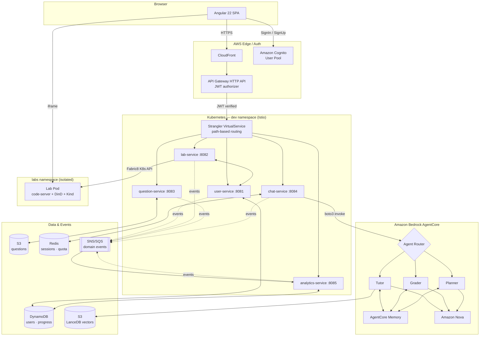
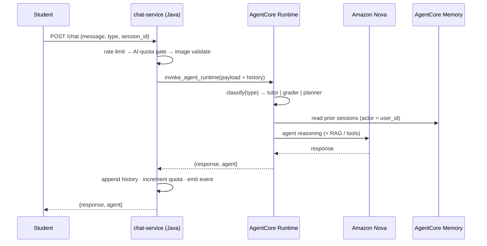
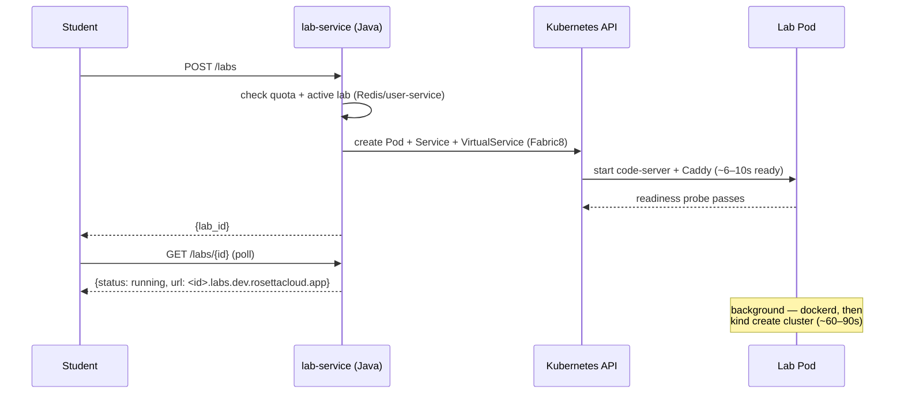

# RosettaCloud — Event-Driven Interactive Learning Platform

[](https://aws.amazon.com/)
[](https://angular.dev/)
[](https://spring.io/projects/spring-boot)
[](https://openjdk.org/)
[](https://aws.amazon.com/bedrock/)
[](https://kubernetes.io/)
[](https://terraform.io/)
[](LICENSE)

RosettaCloud is a production-grade, cloud-native learning platform that gives every student a **real, disposable cloud environment in the browser** — VS Code, a Docker daemon, and a Kubernetes cluster — paired with an **AI multi-agent tutor** that teaches, grades, and plans. It targets the skills that get people *hired* (Linux, Docker, Kubernetes, cloud engineering), not just certified.

> **This is not a simulation.** Labs run as isolated Kubernetes pods; the AI runs entirely on **AWS-native models** (Amazon Nova via Bedrock AgentCore) — no third-party LLMs in the request path.

🎥 **Demo:** https://youtu.be/EzsJ9wofGOo

---

## Table of Contents

- [What It Solves](#what-it-solves)
- [Core Functionality](#core-functionality)
- [Platform Architecture](#platform-architecture)
- [Microservices](#microservices)
- [AI Multi-Agent System (Bedrock AgentCore)](#ai-multi-agent-system-bedrock-agentcore)
- [Interactive Lab Environments](#interactive-lab-environments)
- [Data Layer](#data-layer)
- [Resilience & Reliability](#resilience--reliability)
- [Security](#security)
- [Deployment Model & CI/CD](#deployment-model--cicd)
- [Technology Stack](#technology-stack)
- [Repository Structure](#repository-structure)
- [Getting Started](#getting-started)
- [Performance](#performance)
- [Documentation Map](#documentation-map)
- [Author & License](#author--license)

---

## What It Solves

Traditional learning platforms hit three walls:

- **Setup friction** — "install Docker/kubectl/an IDE" loses learners before they start.
- **Content ≠ competence** — videos and quizzes don't build the muscle memory of running real commands against real infrastructure.
- **Slow, generic feedback** — learners wait, and get feedback that doesn't know what they actually did.

RosettaCloud answers each with a cloud-native, event-driven design:

- **~6–10 second** lab provisioning (pod ready) instead of multi-minute VM setups.
- **Real infrastructure per student** — a Dockerized VS Code plus a Kubernetes-in-Docker cluster, isolated per namespace.
- **Context-aware AI** — a tutor that gives hints (not answers), a grader that assesses actual work, and a planner that sequences the next steps — with cross-session memory.

---

## Core Functionality

### 🔬 Interactive Labs
On-demand, isolated **code-server (VS Code) + Docker-in-Docker + Kind (Kubernetes)** environments, provisioned as Kubernetes pods and reached over an auto-generated per-lab subdomain. Automated shell-script checks verify student progress in-pod.

### 🤖 AI Multi-Agent Tutor
An Amazon **Bedrock AgentCore** runtime routes each message to the right specialist agent — **Tutor** (hint-first help), **Grader** (assesses attempts), **Planner** (session/next-step planning) — all reasoning on **Amazon Nova**, with **AgentCore Memory** for cross-session continuity.

### 📚 Retrieval-Augmented Generation (RAG)
Course material and lab shell-scripts are embedded with **Amazon Titan** and stored in **LanceDB on S3**; the tutor retrieves relevant context so answers are grounded in the actual curriculum.

### 📸 Multimodal "Snap & Ask"
Students capture their screen in-browser; the image is sent to a vision-capable Nova model for visual troubleshooting ("why is my pod stuck in `Pending`?").

### 📊 Event-Driven Feedback & Analytics
Lab/question/chat activity emits domain events (SNS/SQS) consumed by the analytics service for progress tracking, quotas, and pilot metrics — asynchronous, so it never blocks the learning loop.

### 🔐 Accounts, Quotas & Fair Use
Amazon **Cognito** authentication (email verification, JWT), with weekly free-tier quotas (lab minutes + AI messages) and per-user rate limiting.

---

## Platform Architecture

RosettaCloud is a **strangler-fig microservices** system: an Angular SPA behind CloudFront, a JWT-authorized API Gateway, an Istio path-router fanning out to one Spring Boot service per domain, an AgentCore AI plane, and Kubernetes-provisioned lab pods.


```mermaid
graph TB
    subgraph Client["Browser"]
        UI[Angular 22 SPA]
    end

    subgraph Edge["AWS Edge / Auth"]
        CF[CloudFront]
        AGW[API Gateway HTTP API<br/>JWT authorizer]
        COG[Amazon Cognito<br/>User Pool]
    end

    subgraph Mesh["Kubernetes — dev namespace (Istio)"]
        VS[Strangler VirtualService<br/>path-based routing]
        USER[user-service :8081]
        LAB[lab-service :8082]
        Q[question-service :8083]
        CHAT[chat-service :8084]
        AN[analytics-service :8085]
    end

    subgraph Labs["labs namespace (isolated)"]
        POD[Lab Pod<br/>code-server + DinD + Kind]
    end

    subgraph AI["Amazon Bedrock AgentCore"]
        RT{Agent Router}
        TUT[Tutor]
        GRD[Grader]
        PLN[Planner]
        MEM[AgentCore Memory]
        NOVA[Amazon Nova]
    end

    subgraph Data["Data & Events"]
        DDB[(DynamoDB<br/>users · progress)]
        S3Q[(S3<br/>questions)]
        S3V[(S3<br/>LanceDB vectors)]
        REDIS[(Redis<br/>sessions · quota)]
        SQS[[SNS/SQS<br/>domain events]]
    end

    UI -->|HTTPS| CF --> AGW
    UI -->|SignIn / SignUp| COG
    AGW -->|JWT verified| VS
    VS --> USER & LAB & Q & CHAT & AN
    LAB -->|Fabric8 K8s API| POD
    UI -->|iframe| POD
    CHAT -->|boto3 invoke| RT
    RT --> TUT & GRD & PLN --> NOVA
    TUT --> S3V
    TUT & GRD & PLN <--> MEM
    USER & AN <--> DDB
    Q <--> S3Q
    CHAT <--> REDIS
    LAB <--> USER
    USER & LAB & Q & CHAT & AN -.events.-> SQS --> AN
```

**Request flow:** the SPA authenticates directly against Cognito and stores the ID token; every API call goes CloudFront → API Gateway (JWT authorizer) → Istio strangler `VirtualService`, which routes by path prefix (`/users`, `/labs`, `/questions`, `/chat`, `/admin/metrics`, `/public/stats`) to the matching Spring Boot service. Each service resolves identity from the JWT (`custom:user_id` ?? `sub`).

> **Note:** an earlier version ran a Python **FastAPI monolith**; it has been fully replaced by the Spring Boot microservices below and removed from the codebase.

---

## Microservices

`Backend-Java/` is a **Spring Boot 4 / Java 25** Maven multi-module project — one service per domain plus a shared auto-configuration library.

| Service | Port | Responsibility |
|---|---|---|
| **user-service** | 8081 | Users, profiles, lab-minute & AI-message quotas, active-lab/session bookkeeping, progress (DynamoDB) |
| **lab-service** | 8082 | Lab lifecycle — creates Pod + Service + Istio `VirtualService` per lab, TTL janitor, in-cluster provisioning via the Fabric8 Kubernetes client |
| **question-service** | 8083 | Question content + in-pod `exec` grading of shell-script checks |
| **chat-service** | 8084 | AI chat proxy → AgentCore/Bedrock, Redis-backed session history, rate limiting, AI-quota gating, multimodal image validation |
| **analytics-service** | 8085 | Usage/progress analytics, consumes SNS/SQS domain events |
| **shared-lib** | — | Cross-cutting auto-config: Cognito JWT resource-server, RFC 7807 error handling, resilience (`HttpRetry`), event publishing, AWS/DynamoDB helpers |

- **Java toolchain:** JDK 25 (Corretto), Maven wrapper. `./mvnw -B -ntp verify` runs unit + web-slice + **Testcontainers** integration tests across all modules; a JaCoCo line-coverage gate guards the build.
- **API contract:** snake_case JSON, RFC 7807 `application/problem+json` errors.
- `/internal/**` endpoints are cluster-internal only (never exposed through the public gateway; enforced by a NetworkPolicy allow-list).

---

## AI Multi-Agent System (Bedrock AgentCore)

The AI "plane" is a managed **Amazon Bedrock AgentCore Runtime** (Python, [Strands Agents](https://strandsagents.com/) SDK) deployed via the `agentcore` CLI (ARM64 image built on CodeBuild). `chat-service` invokes it over IAM.


```mermaid
sequenceDiagram
    participant Student
    participant Chat as chat-service (Java)
    participant AC as AgentCore Runtime
    participant Nova as Amazon Nova
    participant Mem as AgentCore Memory

    Student->>Chat: POST /chat {message, type, session_id}
    Chat->>Chat: rate limit → AI-quota gate → image validate
    Chat->>AC: invoke_agent_runtime(payload + history)
    AC->>AC: classify(type) → tutor | grader | planner
    AC->>Mem: read prior sessions (actor = user_id)
    AC->>Nova: agent reasoning (+ RAG / tools)
    Nova-->>AC: response
    AC-->>Chat: {response, agent}
    Chat->>Chat: append history · increment quota · emit event
    Chat-->>Student: {response, agent}
```

- **Routing:** `type=hint → Tutor`, `type=grade → Grader`, `type=session_start → Planner`, else a Nova classifier picks the agent.
- **Models:** Amazon **Nova** for reasoning/vision; Amazon **Titan** embeddings for RAG indexing.
- **Memory:** AgentCore Memory provides long-term, per-student continuity across sessions.
- **RAG store:** **LanceDB on S3**; a `document_indexer` Lambda (re)indexes questions/shell-scripts on change (S3 → EventBridge → Lambda).
- **Provider-agnostic:** `chat-service` can target the AgentCore runtime or a direct Bedrock invoker via a config toggle.

The Python that remains in `Backend/` is exactly this AI plane plus its serverless helpers: `agents/` (the AgentCore runtime), `serverless/Lambda/` (`document_indexer`, `agent_tools`), and `questions/` (shell-script lab content synced to S3).

---

## Interactive Lab Environments


```mermaid
sequenceDiagram
    participant Student
    participant Lab as lab-service (Java)
    participant K8s as Kubernetes API
    participant Pod as Lab Pod

    Student->>Lab: POST /labs
    Lab->>Lab: check quota + active lab (Redis/user-service)
    Lab->>K8s: create Pod + Service + VirtualService (Fabric8)
    K8s->>Pod: start code-server + Caddy (~6–10s ready)
    Pod-->>K8s: readiness probe passes
    Lab-->>Student: {lab_id}
    Student->>Lab: GET /labs/{id} (poll)
    Lab-->>Student: {status: running, url: <id>.labs.dev.rosettacloud.app}
    Note over Pod: background — dockerd, then<br/>kind create cluster (~60–90s)
```

- **Lab image** (`DevSecOps/interactive-labs/`): `code-server` (VS Code) + **Docker-in-Docker** + **kubectl** + **Kind** (with a pre-pulled node image) + Python/Node — a full cloud-engineering workbench in one pod.
- **Fast start:** the editor is reachable in ~6–10 s; the in-pod Kubernetes cluster finishes bootstrapping in the background (~60–90 s).
- **Isolation:** lab pods run in a dedicated `labs` namespace with a ResourceQuota, LimitRange, and NetworkPolicies that block access to the cloud metadata endpoint (`169.254.169.254`) and cluster-internal RFC1918 ranges.

---

## Data Layer

| Store | Purpose |
|---|---|
| **Amazon DynamoDB** | Users, roles, progress, quotas |
| **Amazon S3** | Question/shell-script content + LanceDB vector store |
| **Redis** | Chat session history, rate-limit counters, active-lab tracking |
| **SNS + SQS** | Event backbone (lab/question/chat activity → analytics) |
| **AgentCore Memory** | Long-term, per-student AI memory |

---

## Resilience & Reliability

- **Circuit breakers** (Spring Cloud CircuitBreaker + Resilience4j): `lab-service → user-service` (per-call, fail-open) and `chat-service → AI plane` (a "tutor temporarily unavailable" fallback that does **not** consume the student's AI quota on failure).
- **Retries inside the breaker:** transient I/O is retried (`HttpRetry`) *within* each breaker, so rolling-deploy blips are absorbed while a *sustained* outage fast-fails instead of piling up timeouts.
- **Graceful degradation everywhere:** inter-service failures return safe defaults rather than 500s, so a single dependency hiccup never fails an otherwise-successful lab launch or chat turn.

---

## Security

- **Authentication:** Amazon Cognito user pool; JWT-authorized API Gateway; services validate issuer + audience and derive identity from the token.
- **Hardened pods (Pod Security "restricted"):** all five services run `runAsNonRoot` (uid 1000), `readOnlyRootFilesystem`, `capabilities: drop [ALL]`, `seccompProfile: RuntimeDefault`, with CPU/memory requests+limits. The hardened frontend image serves on a non-root port `:8080`.
- **Network isolation:** default-deny NetworkPolicies with explicit allow-lists; the `labs` namespace blocks metadata/IMDS and cluster RFC1918 egress to prevent pivoting or credential theft from lab pods.
- **Supply-chain / IaC scanning (`security.yml`):** Trivy secret gate, fixable-CRITICAL CVE gate, and an **8-check Kubernetes misconfig regression gate**; Semgrep SAST (informational).
- **No static cloud credentials:** every workflow authenticates with **GitHub OIDC**.

---

## Deployment Model & CI/CD

> ### ⚠️ No live EKS
> There is intentionally **no persistent EKS cluster**. The verified, cost-free deploy/verification target is a **k3s cluster spun up inside the GitHub Actions runner**: images are built → pushed to ECR → imported into in-runner k3s → deployed → smoke-tested. Any EKS-specific step in a workflow is gated (`if aws eks describe-cluster … else skip`). Terraform provisions the supporting AWS resources (VPC, ECR, IAM, S3, Route 53, CloudFront, Cognito, API Gateway, SNS/SQS, DynamoDB) — **no EKS module**.

| Workflow | Trigger | What it does |
|---|---|---|
| `frontend-ci.yml` | push/PR `Frontend/**` | Node 24: `npm ci`, ESLint, typecheck, prod build, **Vitest + coverage gate**, npm audit, **Playwright** e2e (deterministic, mocked) |
| `frontend-deploy.yml` | dispatch + push `Frontend/src/**` | Build Angular 22 image → ECR → deploy to in-runner k3s (hardened non-root nginx `:8080`) → curl smoke |
| `backend-java-ci.yml` | push/PR `Backend-Java/**` | JDK 25 `./mvnw verify` — unit + Testcontainers test gate |
| `backend-java-deploy.yml` | dispatch | Build 5 service images (test-gated) → ECR → in-runner k3s + securityContext assertions + PSA-restricted probe + smoke |
| `e2e-k3s.yml` | dispatch + nightly | Full stack on k3s + **real Amazon Nova** cross-service probe |
| `frontend-e2e-fullstack.yml` | dispatch + nightly | SPA + strangler gateway + live backend on k3s (Playwright) |
| `security.yml` | push `Backend-Java/**`, `DevSecOps/**` | Trivy (secret + CVE + KSV misconfig gates) + Semgrep |
| `agent-deploy.yml` | push `Backend/agents/**` | `agentcore launch` (CodeBuild ARM64) + update K8s ConfigMap ARN |
| `lambda-deploy.yml` | push `Backend/serverless/Lambda/**` | Build/push `document_indexer` + `agent_tools` Lambda images |
| `questions-sync.yml` | push `Backend/questions/**` | Sync questions → S3 → EventBridge → RAG re-indexing |

Account `339712964409` · region `us-east-1` · ECR repos `rosettacloud-*`.

---

## Technology Stack

- **Frontend:** Angular 22 (standalone components, esbuild `@angular/build`), TypeScript, SCSS/Bootstrap 5, xterm.js; Vitest + Playwright + ESLint.
- **Backend API:** Spring Boot 4 on Java 25, Spring Web/Security (OAuth2 resource server), Spring Cloud CircuitBreaker + Resilience4j, Fabric8 Kubernetes client, AWS SDK v2; Maven multi-module.
- **AI/ML:** Amazon Bedrock **AgentCore** (runtime + memory + gateway), **Amazon Nova**, **Amazon Titan** embeddings, **Strands Agents**, **LanceDB** (on S3); Python 3.12.
- **Data/Events:** DynamoDB, S3, Redis, SNS/SQS, EventBridge.
- **Platform/DevSecOps:** Kubernetes (EKS-ready manifests; k3s-in-runner for CI), Istio (strangler routing), Docker, Terraform (IaC), GitHub Actions (OIDC), Trivy + Semgrep.
- **Auth/Edge:** Amazon Cognito, API Gateway (HTTP API + JWT authorizer), CloudFront, Route 53, ACM.

---

## Repository Structure

```
RosettaCloud/
├── Frontend/           # Angular 22 SPA (Vitest, Playwright, ESLint) + hardened nginx Dockerfile
├── Backend-Java/       # Spring Boot 4 / Java 25 microservices (the live API)
│   ├── user-service/  lab-service/  question-service/  chat-service/  analytics-service/
│   ├── shared-lib/     # cross-cutting auto-config (JWT, errors, resilience, events, AWS)
│   └── e2e/            # in-runner k3s e2e stack + probe
├── Backend/            # remaining Python
│   ├── agents/         # Bedrock AgentCore multi-agent runtime (tutor/grader/planner)
│   ├── serverless/     # Lambda functions (document_indexer, agent_tools)
│   └── questions/      # shell-script lab content (synced to S3)
├── DevSecOps/
│   ├── K8S/            # manifests: strangler VirtualService, labs ns, NetworkPolicies, PSA, ingress
│   ├── Terraform/      # IaC (no EKS module)
│   └── interactive-labs/  # the code-server + DinD + Kind lab image
├── .github/workflows/  # 10 CI/CD pipelines (GitHub OIDC)
└── AGENTS.md           # agent/contributor handoff (per-directory AGENTS.md too)
```

Each working directory has its own **`AGENTS.md`** with build/test commands and gotchas.

---

## Getting Started

**Prerequisites:** Node ≥ 24.15 (nvm), JDK 25 (Corretto), an AWS account with Bedrock (Nova/Titan) enabled, and AWS CLI v2. (Docker/k3s image builds happen in CI.)

```bash
git clone https://github.com/mohamedsorour1998/RosettaCloud.git
cd RosettaCloud
```

**Frontend (Angular 22):**
```bash
cd Frontend
npm ci
npx ng serve                              # dev server → http://localhost:4200
npx ng test --watch=false                 # Vitest (via Angular's builder)
npx ng lint && npx playwright test        # lint + deterministic e2e
```

**Backend API (Spring Boot 4 / Java 25):**
```bash
cd Backend-Java
./mvnw -B -ntp verify                      # build + test all modules
./mvnw -pl user-service spring-boot:run    # run one service (user :8081 … analytics :8085)
```

**AI runtime (AgentCore) & infra:**
```bash
cd Backend/agents && agentcore status      # inspect the multi-agent runtime
cd DevSecOps/Terraform/environments/shared && terraform plan -var-file=terraform.tfvars
```

See per-directory `AGENTS.md` and the plan docs for full procedures.

---

## Performance

| Metric | Result |
|---|---|
| Lab editor ready (pod) | **~6–10 s** (in-pod Kind cluster ~60–90 s in background) |
| AI response (typical) | **~1–2 s** |
| Concurrent users | Tested **1,000+** (horizontal pod autoscaling) |
| Cost per free-tier user | **~$0.40 / month** (spot compute + Nova Lite) |
| Cost reduction vs. baseline | **~60%** (spot + serverless + right-sizing) |

---

## Documentation Map

| Doc | Contents |
|---|---|
| [`AGENTS.md`](AGENTS.md) | Whole-repo agent/contributor handoff (current state, commands, conventions) |
| [`Frontend/AGENTS.md`](Frontend/AGENTS.md) · [`Backend-Java/AGENTS.md`](Backend-Java/AGENTS.md) · [`DevSecOps/AGENTS.md`](DevSecOps/AGENTS.md) · [`Backend/AGENTS.md`](Backend/AGENTS.md) | Per-directory context + commands |
| [`Frontend/README.md`](Frontend/README.md) · [`Backend/README.md`](Backend/README.md) · [`DevSecOps/README.md`](DevSecOps/README.md) | Component deep-dives |
| `Frontend/ANGULAR-22-MIGRATION-AND-API-CUTOVER-PLAN.md` | Angular 19→22 + FastAPI→Java cutover plan |
| `DevSecOps/POD-SECURITYCONTEXT-HARDENING-PLAN.md` | Pod hardening plan |
| `Backend-Java/AGENTCORE-RESILIENCE4J-RUNTIME-PLAN.md` | AgentCore + circuit-breaker plan |

---

## Author & License

**Mohamed Sorour** — Senior DevOps Engineer & AWS Community Builder
📧 mohamedsorour1998@gmail.com · 💼 [LinkedIn](https://linkedin.com/in/mohamedsorour) · 🐱 [@mohamedsorour](https://github.com/mohamedsorour)

Licensed under the **MIT License** — see [`LICENSE`](LICENSE).

> *Building intelligent learning platforms that combine educational depth with modern AI/ML and platform engineering.* ⭐ If this project is useful to you, please star it.
