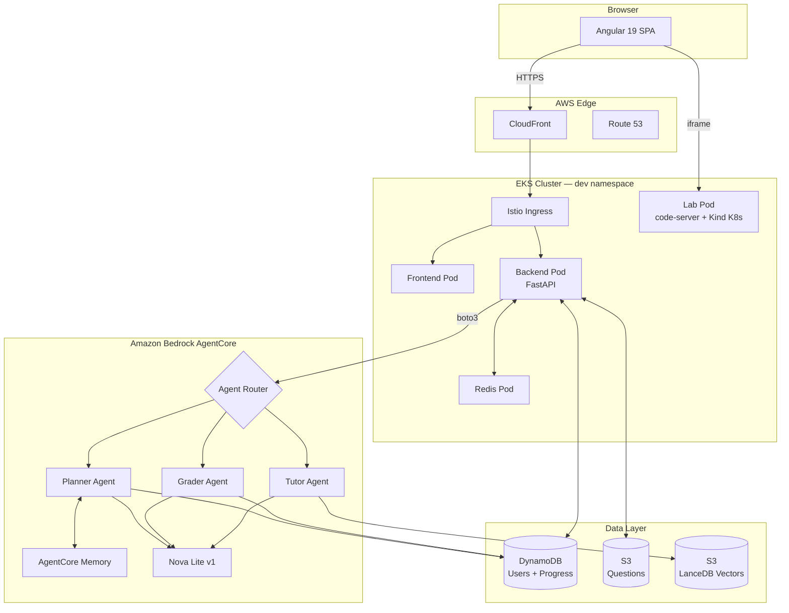
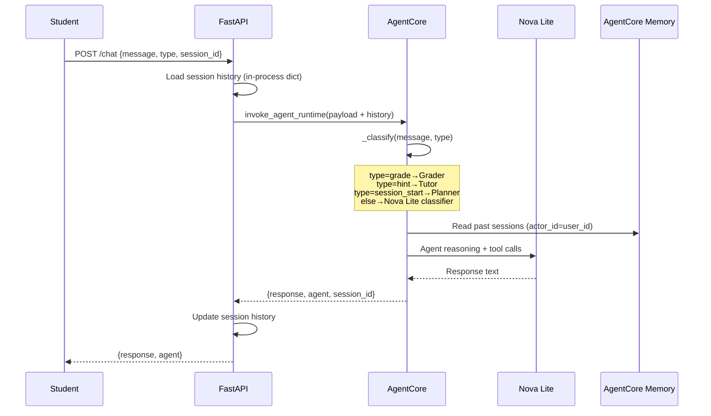
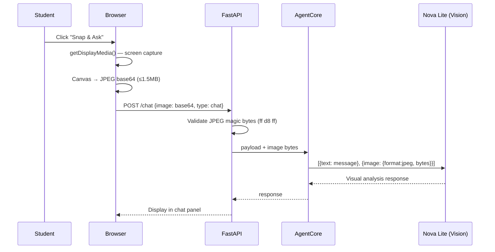
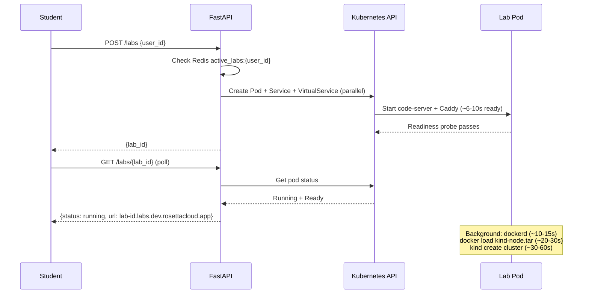

# Chat Polish Features Implementation Plan

> **For Claude:** REQUIRED SUB-SKILL: Use superpowers:executing-plans to implement this plan task-by-task.

**Goal:** Add three UX improvements to the lab chat — "Ask About This Question" shortcut, a chat-bubble typing indicator, and proper markdown rendering for AI responses.

**Architecture:** All changes are frontend-only Angular. Task 1 touches `lab.component.*`. Tasks 2–3 touch `chatbot.component.*`. No new npm packages are needed — markdown will be done via extended regex chains in the existing `formatMessage()` method.

**Tech Stack:** Angular 19, SCSS, TypeScript strict mode, `DomSanitizer` (already injected in chatbot component)

---

## Task 1: "Ask About This Question" button

Add a small `?` icon button next to each question title in the sidebar. Clicking it sends `"Can you explain Question N to me? ..."` to the chat and opens the chat panel.

**Files:**
- Modify: `Frontend/src/app/lab/lab.component.ts` — add `askAboutQuestion()` method
- Modify: `Frontend/src/app/lab/lab.component.html` — wrap question title in a row with button
- Modify: `Frontend/src/app/lab/lab.component.scss` — add `.question-title-row` + `.btn-ask-ai`

### Step 1: Add `askAboutQuestion()` to `lab.component.ts`

Find the `openChatPanel()` method (~line 1103). Add the new method directly below it:

```typescript
  /**
   * Ask the AI to explain the current question
   */
  askAboutQuestion(): void {
    const q = this.currentQuestion;
    if (!q) return;
    if (this.isMobile) {
      this.showChatbot = true;
      this.showSidebar = false;
    }
    this.chatbotSv.sendMessage(
      `Can you explain Question ${q.id} to me? The question is: "${q.question}"`
    );
  }
```

### Step 2: Update question title in `lab.component.html`

Find line 219:
```html
        <h5 class="question-title">{{ cq.question }}</h5>
```

Replace with:
```html
        <div class="question-title-row">
          <h5 class="question-title">{{ cq.question }}</h5>
          <button
            class="btn-ask-ai"
            (click)="askAboutQuestion()"
            title="Ask AI to explain this question"
          >
            <i class="bi bi-question-circle"></i>
          </button>
        </div>
```

### Step 3: Add styles to `lab.component.scss`

Find the `.question-title` rule inside `.question-details` (~line 505):
```scss
    .question-title {
      font-size: 1.1rem;
      font-weight: 600;
      margin-bottom: 1.25rem;
      line-height: 1.4;
    }
```

Replace with:
```scss
    .question-title-row {
      display: flex;
      align-items: flex-start;
      gap: 0.5rem;
      margin-bottom: 1.25rem;
    }

    .question-title {
      flex: 1;
      font-size: 1.1rem;
      font-weight: 600;
      margin: 0;
      line-height: 1.4;
    }

    .btn-ask-ai {
      flex-shrink: 0;
      background: none;
      border: none;
      color: var(--primary-color);
      cursor: pointer;
      opacity: 0.6;
      padding: 0.1rem 0.3rem;
      border-radius: 50%;
      transition: all 0.2s ease;
      font-size: 1.1rem;
      margin-top: 0.1rem;

      &:hover {
        opacity: 1;
        background: rgba(var(--bs-primary-rgb), 0.1);
      }
    }
```

### Step 4: Build and verify

```bash
cd /home/sorour/RosettaCloud/Frontend
ng build --configuration=development 2>&1 | tail -20
```

Expected: build succeeds with 0 errors.

### Step 5: Commit

```bash
cd /home/sorour/RosettaCloud
git add Frontend/src/app/lab/lab.component.ts Frontend/src/app/lab/lab.component.html Frontend/src/app/lab/lab.component.scss
git commit -m "feat: add 'Ask AI' shortcut button on question card"
```

---

## Task 2: Chat-bubble typing indicator

The current loading state is a plain centered row. Replace it with a proper assistant chat bubble containing three pulsing dots — looks alive during the demo.

**Files:**
- Modify: `Frontend/src/app/chatbot/chatbot.component.html` — replace loading indicator HTML
- Modify: `Frontend/src/app/chatbot/chatbot.component.scss` — replace `.loading-indicator` with `.typing-indicator` styles

### Step 1: Replace loading indicator HTML in `chatbot.component.html`

Find lines 197–205:
```html
      <!-- Loading Indicator -->
      <div class="loading-indicator" *ngIf="isLoading">
        <div class="loading-animation">
          <div class="dot dot-1"></div>
          <div class="dot dot-2"></div>
          <div class="dot dot-3"></div>
        </div>
        <div class="loading-text">Processing your request...</div>
      </div>
```

Replace with:
```html
      <!-- Typing Indicator -->
      <div class="typing-indicator" *ngIf="isLoading">
        <div class="message-avatar assistant-avatar">
          <i class="bi bi-robot"></i>
        </div>
        <div class="typing-bubble">
          <span class="typing-dot"></span>
          <span class="typing-dot"></span>
          <span class="typing-dot"></span>
        </div>
      </div>
```

### Step 2: Replace CSS in `chatbot.component.scss`

Find the `.loading-indicator` block (lines 532–573):
```scss
// Loading indicator
.loading-indicator {
  display: flex;
  flex-direction: column;
  ...
}
```

Replace that entire block with:
```scss
// Typing indicator — chat bubble with animated dots
.typing-indicator {
  display: flex;
  align-items: flex-start;
  gap: 0.75rem;
  padding: 0.5rem 0;
  animation: fadeIn 0.3s ease-out;

  .typing-bubble {
    display: flex;
    align-items: center;
    gap: 0.375rem;
    padding: 1rem 1.25rem;
    border-radius: 0 1.25rem 1.25rem 1.25rem;
    min-width: 4.5rem;
    border: 1px solid;
  }

  .typing-dot {
    display: inline-block;
    width: 0.5rem;
    height: 0.5rem;
    border-radius: 50%;
    background-color: var(--primary-color);
    opacity: 0.7;

    &:nth-child(1) {
      animation: bounce 1.4s infinite ease-in-out;
      animation-delay: -0.32s;
    }

    &:nth-child(2) {
      animation: bounce 1.4s infinite ease-in-out;
      animation-delay: -0.16s;
    }

    &:nth-child(3) {
      animation: bounce 1.4s infinite ease-in-out;
    }
  }
}
```

### Step 3: Add dark/light mode styles for the typing bubble

In the dark mode block (`:host-context([data-bs-theme="dark"])`), find the `.loading-indicator` rule and replace it with:
```scss
  .typing-indicator {
    .typing-bubble {
      background-color: var(--dark-card-bg);
      border-color: var(--dark-border-color);
    }

    .typing-dot {
      background-color: var(--primary-color);
    }
  }
```

In the light mode block (`:host-context([data-bs-theme="light"])`), find and replace the `.loading-indicator` rule:
```scss
  .typing-indicator {
    .typing-bubble {
      background-color: white;
      border-color: var(--light-border-color);
    }

    .typing-dot {
      background-color: var(--primary-color);
    }
  }
```

### Step 4: Build and verify

```bash
cd /home/sorour/RosettaCloud/Frontend
ng build --configuration=development 2>&1 | tail -20
```

Expected: 0 errors.

### Step 5: Commit

```bash
cd /home/sorour/RosettaCloud
git add Frontend/src/app/chatbot/chatbot.component.html Frontend/src/app/chatbot/chatbot.component.scss
git commit -m "feat: replace loading indicator with chat-bubble typing indicator"
```

---

## Task 3: Markdown rendering in chat messages

Nova's responses use `**bold**`, `## headers`, `- lists`, `*italic*`. The existing `formatMessage()` handles code blocks and inline code but nothing else. Extend it with a placeholder-based approach that protects code blocks while processing all markdown patterns.

**Files:**
- Modify: `Frontend/src/app/chatbot/chatbot.component.ts` — rewrite `formatMessage()` method
- Modify: `Frontend/src/app/chatbot/chatbot.component.scss` — add markdown element styles inside `.message-text`

### Step 1: Rewrite `formatMessage()` in `chatbot.component.ts`

Find the entire `formatMessage()` method (lines 163–211). Replace it completely with:

```typescript
  /**
   * Formats raw message content with markdown → HTML.
   * Uses a placeholder technique to protect code blocks, then
   * processes headers, bold/italic, lists, inline code, and line breaks.
   */
  formatMessage(content: string): SafeHtml {
    try {
      // Step 1: Extract and replace code blocks with null-char placeholders
      const codeBlocks: string[] = [];
      let processed = content.replace(
        /```([a-zA-Z]*)([\s\S]*?)```/g,
        (match, lang, code) => {
          const isShell = code.includes('#!/bin/');
          const cls = isShell ? 'shell-script-container' : 'code-container';
          const preCls = isShell ? 'shell-script' : 'code-content';
          const placeholder = `\x00CODE${codeBlocks.length}\x00`;
          codeBlocks.push(
            `<div class="${cls}" data-language="${lang || 'code'}">` +
            `<pre class="${preCls}">${this.escapeHtml(code)}</pre></div>`
          );
          return placeholder;
        }
      );

      // Step 2: Headers (must run before bold/italic; ^ needs real \n chars)
      processed = processed
        .replace(/^#### (.+)$/gm, '<h4>$1</h4>')
        .replace(/^### (.+)$/gm, '<h3>$1</h3>')
        .replace(/^## (.+)$/gm, '<h2>$1</h2>')
        .replace(/^# (?!#)(.+)$/gm, '<h1>$1</h1>');

      // Step 3: Bold and italic (order matters: *** before ** before *)
      processed = processed
        .replace(/\*\*\*([^*\n]+)\*\*\*/g, '<strong><em>$1</em></strong>')
        .replace(/\*\*([^*\n]+)\*\*/g, '<strong>$1</strong>')
        .replace(/\*([^*\n]+)\*/g, '<em>$1</em>');

      // Step 4: Lists — split into lines, group consecutive list items
      const lines = processed.split('\n');
      const htmlLines: string[] = [];
      let inUl = false;

      for (const line of lines) {
        const ulMatch = line.match(/^[-*] (.+)/);
        const olMatch = line.match(/^\d+\. (.+)/);

        if (ulMatch || olMatch) {
          if (!inUl) {
            htmlLines.push('<ul>');
            inUl = true;
          }
          htmlLines.push(`<li>${(ulMatch ? ulMatch[1] : olMatch![1])}</li>`);
        } else {
          if (inUl) {
            htmlLines.push('</ul>');
            inUl = false;
          }
          htmlLines.push(line);
        }
      }
      if (inUl) htmlLines.push('</ul>');
      processed = htmlLines.join('\n');

      // Step 5: Inline code
      processed = processed.replace(/`([^`]+)`/g, '<code class="inline-code">$1</code>');

      // Step 6: Newlines → <br>, double <br> → paragraph break
      processed = processed
        .replace(/\n/g, '<br>')
        .replace(/<br><br>/g, '</p><p>');

      // Step 7: Wrap in <p> if not already block-level
      if (!processed.match(/^<(h[1-4]|ul|ol|p|div)/)) {
        processed = '<p>' + processed + '</p>';
      }

      // Step 8: Restore code block placeholders
      codeBlocks.forEach((block, i) => {
        processed = processed.replace(`\x00CODE${i}\x00`, block);
      });

      // Step 9: Inject responsive classes on tables/imgs/links
      processed = processed
        .replace(/<table/g, '<table class="responsive-table"')
        .replace(/${content}</p>`);
    }
  }
```

### Step 2: Add markdown element CSS inside `.message-text` in `chatbot.component.scss`

Find the `.message-text` block that starts with `font-size: 1rem` (~line 429):
```scss
  .message-text {
    font-size: 1rem;
    line-height: 1.6;
    ...
    p {
      margin: 0 0 1rem 0;
      ...
    }
  }
```

Add these rules INSIDE `.message-text`, after the `p` block:

```scss
    h1, h2, h3, h4 {
      margin: 0.75rem 0 0.375rem 0;
      font-weight: 600;
      line-height: 1.3;

      &:first-child { margin-top: 0; }
    }

    h1 { font-size: 1.35rem; }
    h2 { font-size: 1.2rem; }
    h3 { font-size: 1.05rem; }
    h4 { font-size: 1rem; }

    ul, ol {
      margin: 0.375rem 0 0.75rem 0;
      padding-left: 1.5rem;
    }

    li {
      margin-bottom: 0.25rem;
      line-height: 1.5;
    }

    strong { font-weight: 700; }
    em { font-style: italic; }
```

### Step 3: Build and verify

```bash
cd /home/sorour/RosettaCloud/Frontend
ng build --configuration=development 2>&1 | tail -20
```

Expected: 0 errors, no type errors in `formatMessage`.

### Step 4: Quick sanity check

Open the Angular dev server if needed:
```bash
cd /home/sorour/RosettaCloud/Frontend
ng serve --port 4200
```

Then open a browser and send a test message like:
```
**Bold text** and *italic* here.
## This is a heading
- Item one
- Item two
```

Expected: bold/italic text renders, heading is larger, bullets are proper HTML `<li>` items.

### Step 5: Commit

```bash
cd /home/sorour/RosettaCloud
git add Frontend/src/app/chatbot/chatbot.component.ts Frontend/src/app/chatbot/chatbot.component.scss
git commit -m "feat: add markdown rendering for bold, headers, and lists in chat"
```

---

---

## Task 4: Session Intelligence Card

When a student opens a lab, the Planner agent proactively sends a personalised welcome message using AgentCore Memory (past sessions) and the student's current progress. It appears in the chat panel automatically — no user action needed. The demo effect: the AI _knows_ the student before they say a word.

**Files:**
- Modify: `Backend/agents/agent.py` — route `session_start` to planner, construct welcome prompt
- Modify: `Frontend/src/app/services/chatbot.service.ts` — add `sendSessionStart()` method
- Modify: `Frontend/src/app/lab/lab.component.ts` — call `sendSessionStart()` when lab becomes active

No backend `main.py` changes needed — `type` is already forwarded to AgentCore.

### Step 1: Add `session_start` routing to `agent.py`

**Step 1a — route to planner:** In `_classify()` (~line 140), add after the `hint` check:

```python
    if msg_type == "session_start":
        return "planner"
```

**Step 1b — build welcome prompt:** In `invoke()` (~line 184), after the existing grade message block, add:

```python
    if msg_type == "session_start":
        message = (
            f"Generate a warm, personalised 2–3 sentence welcome card for the student "
            f"starting a lab session in module '{module_uuid}', lesson '{lesson_uuid}'. "
            f"Call get_user_progress to see what they have completed. "
            f"Check AgentCore Memory for any past session context. "
            f"Be specific: mention what they did before (if anything) and suggest one concrete focus for today. "
            f"Be encouraging. Start with 'Welcome back!' or 'Great to see you!' Keep it short."
        )
```

### Step 2: Add `sendSessionStart()` to `chatbot.service.ts`

In `chatbot.service.ts`, add this method after `sendProactiveHint()`:

```typescript
  public sendSessionStart(moduleUuid: string, lessonUuid: string): void {
    // Do NOT add a user bubble — this is a silent system-initiated call.
    // The agent response will appear as a Planner message in the chat.
    this.loadingSubject.next(true);

    this.http
      .post<ChatApiResponse>(this.apiUrl, {
        session_id: this.sessionId,
        message: '',
        user_id: this.userId,
        module_uuid: moduleUuid,
        lesson_uuid: lessonUuid,
        type: 'session_start',
      })
      .subscribe({
        next: (res) => {
          this.addMessage({
            role: 'assistant',
            content: res.response,
            timestamp: new Date(),
            agent: res.agent as AgentType,
          });
          this.loadingSubject.next(false);
        },
        error: () => {
          this.loadingSubject.next(false);
        },
      });
  }
```

### Step 3: Trigger `sendSessionStart()` from `lab.component.ts`

In `handleLabInfo()` (~line 387), find the block that runs when the lab first becomes active:

```typescript
      // Set up first question when lab becomes active
      if (wasNotActive && this.questions.length > 0) {
        console.log('Lab became active, setting up question 1 automatically');
        this.setupQuestion(1);
        this.loadUserProgress();
      }
```

Add one line after `this.loadUserProgress()`:

```typescript
        this.chatbotSv.sendSessionStart(this.moduleUuid!, this.lessonUuid!);
```

### Step 4: Build and verify

```bash
cd /home/sorour/RosettaCloud/Frontend
ng build --configuration=development 2>&1 | tail -20
```

Expected: 0 errors.

### Step 5: Commit frontend + backend together

```bash
cd /home/sorour/RosettaCloud
git add Backend/agents/agent.py \
        Frontend/src/app/services/chatbot.service.ts \
        Frontend/src/app/lab/lab.component.ts
git commit -m "feat: add session intelligence card — planner greets student on lab start"
```

---

## Task 5: Architecture diagram in README

The current README.md describes the old architecture (Momento, LangChain, WebSockets). Replace the `## 🏗️ Platform Architecture` section with accurate Mermaid diagrams reflecting the real stack. GitHub renders Mermaid natively — judges can read it directly.

**Files:**
- Modify: `README.md` — replace the `## 🏗️ Platform Architecture` section and update the Chatbot/RAG descriptions that mention Momento/LangChain/WebSockets

### Step 1: Replace the Platform Architecture section

Find the section starting with:
```
## 🏗️ Platform Architecture
```
...and ending just before:
```
## 🛠️ Technology Stack & DevOps Practices
```

Replace the entire `## 🏗️ Platform Architecture` section (keeping everything before and after it intact) with:

````markdown
## 🏗️ Platform Architecture

### System Overview



### AI Multi-Agent Flow



### Multimodal Screenshot Flow (Snap & Ask)



### Lab Provisioning Flow


````

### Step 2: Fix the outdated Chatbot description

Find the block under `### 🤖 AI-Powered Chatbot with RAG` that says:

```markdown
**Technical Implementation:**
```python
# Core RAG pipeline using LangChain
...
```
```

Replace it (from `**Technical Implementation:**` through the closing ` ``` `) with:

```markdown
**Technical Implementation:**
```python
# Multi-agent routing in AgentCore Runtime (Strands Agents SDK)
# agent.py — simplified
def _classify(message: str, msg_type: str) -> str:
    if msg_type == "grade":   return "grader"
    if msg_type == "hint":    return "tutor"
    if msg_type == "session_start": return "planner"
    # Falls back to Nova Lite classifier for free-form chat
    return nova_lite_classify(message)

def invoke(payload, context=None):
    agent_name = _classify(payload["message"], payload["type"])
    agent = Agent(
        model=BedrockModel("amazon.nova-lite-v1:0"),
        system_prompt=AGENT_CONFIGS[agent_name].prompt,
        tools=AGENT_CONFIGS[agent_name].tools,
        session_manager=AgentCoreMemorySessionManager(config),  # long-term memory
    )
    return agent(f"Student: {payload['message']}")
```
```

Also find the Chatbot Features list and remove the "Streaming Responses: Real-time answer delivery via **WebSockets**" bullet, replacing it with:

```markdown
- **HTTP/REST**: Synchronous POST to `/chat` — no WebSocket complexity
```

### Step 3: Fix the AI/ML Infrastructure section

Find `**Conversational AI Stack:**` and replace the bullet list with:

```markdown
**Conversational AI Stack:**
- **AgentCore Runtime**: Multi-agent platform (tutor/grader/planner) deployed via `agentcore` CLI, ARM64 container on CodeBuild
- **Strands Agents**: AWS open-source framework for tool-using agents
- **Amazon Nova Lite**: Primary reasoning model for all agents (fast, cost-effective)
- **AgentCore Memory**: Long-term cross-session memory (student progress, learning history)
- **LanceDB on S3**: Vector store for RAG — course material and shell script embeddings
- **Amazon Titan Embed v2**: Embedding model for document indexing
```

### Step 4: Build check (README is static — no build needed)

Verify Mermaid syntax renders correctly by pushing to GitHub or using a local Mermaid preview. The diagrams use standard `graph TB` and `sequenceDiagram` syntax supported by GitHub.

### Step 5: Commit

```bash
cd /home/sorour/RosettaCloud
git add README.md
git commit -m "docs: replace outdated architecture with accurate Mermaid diagrams (AgentCore + Nova)"
```

---

## Task 6: Explain-on-hover tooltip for inline code

When the AI responds with a suggestion like `kubectl get pods -n dev`, hovering over that command shows a one-sentence tooltip explaining what it does. No click, no new chat message. Pure Nova Lite magic hidden in a tooltip.

**Files:**
- Modify: `Backend/agents/agent.py` — route `explain` type, override message to 1-sentence format
- Modify: `Backend/app/main.py` — skip chat history for `explain` requests
- Modify: `Frontend/src/app/services/chatbot.service.ts` — add `explainCommand()` returning `Observable<string>`
- Modify: `Frontend/src/app/chatbot/chatbot.component.ts` — add tooltip state + event delegation
- Modify: `Frontend/src/app/chatbot/chatbot.component.html` — add event listeners + tooltip element
- Modify: `Frontend/src/app/chatbot/chatbot.component.scss` — add `.code-tooltip` styles

### Step 1: Route `explain` type in `agent.py`

**Step 1a — classify:** In `_classify()`, add after `session_start`:

```python
    if msg_type == "explain":
        return "tutor"
```

**Step 1b — override message:** In `invoke()`, after the `session_start` block, add:

```python
    if msg_type == "explain":
        message = (
            f"In exactly one sentence (15 words max), plain English, no markdown formatting: "
            f"what does `{message}` do in a Linux/Kubernetes environment?"
        )
```

### Step 2: Skip history for `explain` in `main.py`

In `main.py`, in the `/chat` endpoint, find:

```python
    session_id = request.session_id
    history = _chat_history_get(session_id) if session_id else []
```

Replace with:

```python
    session_id = request.session_id
    # Tooltip explain requests must not pollute or read session history
    history = [] if request.type == "explain" else (
        _chat_history_get(session_id) if session_id else []
    )
```

Then find the history-saving block at the bottom of the `/chat` endpoint:

```python
    if session_id:
        updated = history + [
```

Replace with:

```python
    if session_id and request.type != "explain":
        updated = history + [
```

### Step 3: Add `explainCommand()` to `chatbot.service.ts`

Add these imports at the top of the service file (if not already present):

```typescript
import { Observable, of } from 'rxjs';
import { map, catchError } from 'rxjs/operators';
```

Then add after `sendSessionStart()`:

```typescript
  public explainCommand(command: string): Observable<string> {
    return this.http
      .post<ChatApiResponse>(this.apiUrl, {
        session_id: this.sessionId,
        message: command,
        user_id: this.userId,
        module_uuid: this.moduleUuid,
        lesson_uuid: this.lessonUuid,
        type: 'explain',
      })
      .pipe(
        map((res) => res.response),
        catchError(() => of('A command used in Linux/Kubernetes environments.'))
      );
  }
```

### Step 4: Add tooltip state and handlers to `chatbot.component.ts`

**Step 4a — add imports:** Ensure these are imported at the top:

```typescript
import { ChatbotService, ChatMessage, Source, AgentType } from '../services/chatbot.service';
import { Subscription } from 'rxjs';
```

(They already are — just double-check `map` and `catchError` are not needed in the component itself.)

**Step 4b — add tooltip state** to the class properties (after `copiedMessageId`):

```typescript
  tooltipText = '';
  tooltipVisible = false;
  tooltipX = 0;
  tooltipY = 0;
  private tooltipTimer: any;
```

**Step 4c — add tooltip methods** after `getAgentClass()`:

```typescript
  onCodeHover(event: MouseEvent): void {
    const target = event.target as HTMLElement;
    if (!target.classList.contains('inline-code')) return;
    const command = target.textContent?.trim() || '';
    if (!command || command.length > 120) return;

    clearTimeout(this.tooltipTimer);
    this.tooltipTimer = setTimeout(() => {
      const containerEl = this.chatContainer.nativeElement as HTMLElement;
      const containerRect = containerEl.getBoundingClientRect();
      const targetRect = (target as HTMLElement).getBoundingClientRect();

      this.tooltipX = targetRect.left - containerRect.left;
      this.tooltipY = targetRect.bottom - containerRect.top + containerEl.scrollTop + 6;
      this.tooltipText = 'Loading…';
      this.tooltipVisible = true;

      this.chatbotService.explainCommand(command).subscribe((text) => {
        this.tooltipText = text;
        this.cdr.detectChanges();
      });
    }, 450);
  }

  onCodeHoverOut(event: MouseEvent): void {
    clearTimeout(this.tooltipTimer);
    const related = event.relatedTarget as HTMLElement | null;
    if (!related?.closest('.code-tooltip')) {
      this.tooltipVisible = false;
    }
  }
```

Note: `this.chatbotService` — check the constructor parameter name. In the file it is `private chatbotService: ChatbotService`. Use that name exactly.

**Step 4d — clean up timer on destroy.** In `ngOnDestroy()`, add:

```typescript
    clearTimeout(this.tooltipTimer);
```

### Step 5: Update `chatbot.component.html`

**Step 5a — add event listeners to `.chat-container`:**

Find:
```html
    <div class="chat-container" #chatContainer (scroll)="onScroll($event)">
```

Replace with:
```html
    <div class="chat-container" #chatContainer
         (scroll)="onScroll($event)"
         (mouseover)="onCodeHover($event)"
         (mouseout)="onCodeHoverOut($event)">
```

**Step 5b — add tooltip element** inside `.chat-container`, right before the closing `</div>` of the chat-container (before the scroll-to-bottom button):

```html
      <!-- Inline code tooltip -->
      <div
        class="code-tooltip"
        *ngIf="tooltipVisible"
        [style.left.px]="tooltipX"
        [style.top.px]="tooltipY"
      >
        <i class="bi bi-cpu-fill"></i> {{ tooltipText }}
      </div>
```

### Step 6: Add `.code-tooltip` styles to `chatbot.component.scss`

Add after the `.screenshot-thumb` block:

```scss
// Inline code hover tooltip
.code-tooltip {
  position: absolute;
  z-index: 20;
  background: rgba(15, 23, 42, 0.92);
  color: #e2e8f0;
  padding: 0.375rem 0.75rem;
  border-radius: 0.5rem;
  font-size: 0.8rem;
  max-width: 18rem;
  pointer-events: none;
  animation: fadeIn 0.15s ease;
  box-shadow: 0 4px 12px rgba(0, 0, 0, 0.3);
  line-height: 1.4;

  i {
    margin-right: 0.375rem;
    color: #60a5fa;
    font-size: 0.75rem;
  }
}
```

### Step 7: Build and verify

```bash
cd /home/sorour/RosettaCloud/Frontend
ng build --configuration=development 2>&1 | tail -20
```

Expected: 0 TypeScript errors.

### Step 8: Commit all changes

```bash
cd /home/sorour/RosettaCloud
git add Backend/agents/agent.py \
        Backend/app/main.py \
        Frontend/src/app/services/chatbot.service.ts \
        Frontend/src/app/chatbot/chatbot.component.ts \
        Frontend/src/app/chatbot/chatbot.component.html \
        Frontend/src/app/chatbot/chatbot.component.scss
git commit -m "feat: add explain-on-hover tooltip for inline code using Nova Lite"
```

---

## Final: Trigger CI/CD

After all tasks are committed, push to `main`:

```bash
cd /home/sorour/RosettaCloud
git push origin main
```

This triggers:
- `frontend-build.yml` — rebuilds Angular image, rolls out EKS pod
- `agent-deploy.yml` — redeploys AgentCore if `Backend/agents/**` changed (Tasks 4 + 6 touch `agent.py`)
- `backend-build.yml` — redeploys FastAPI if `Backend/app/**` changed (Task 6 touches `main.py`)
